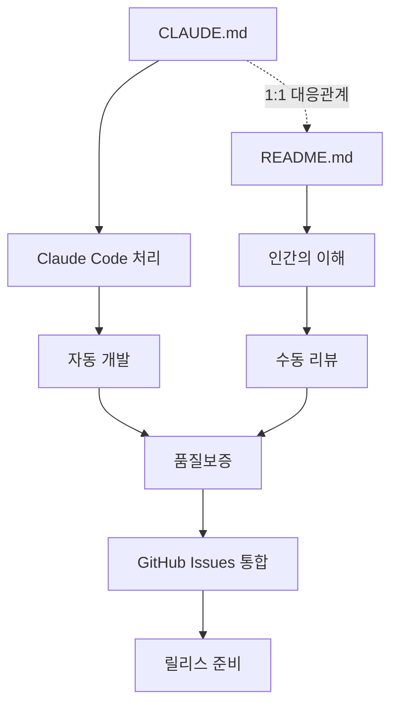
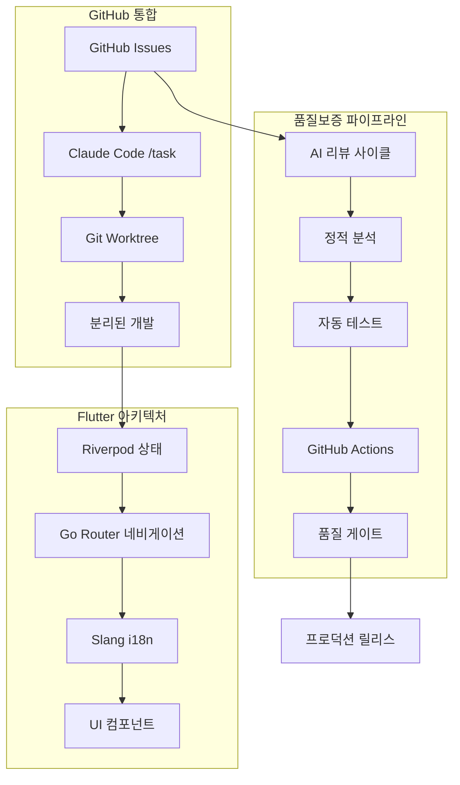
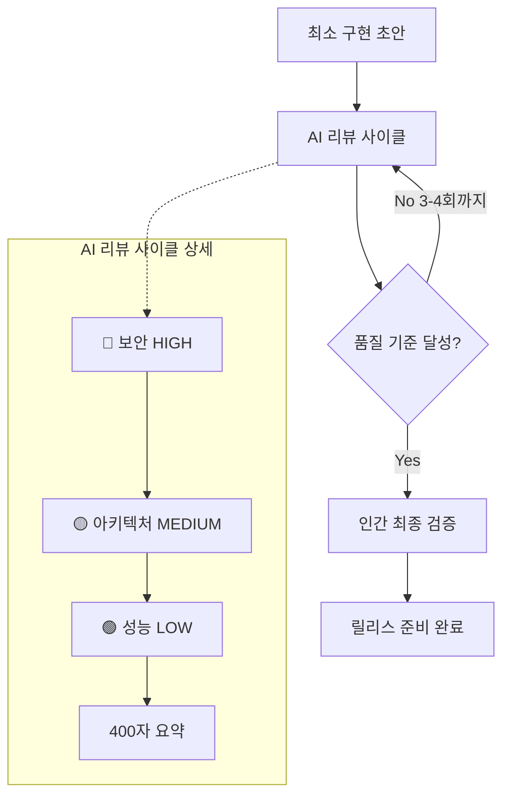
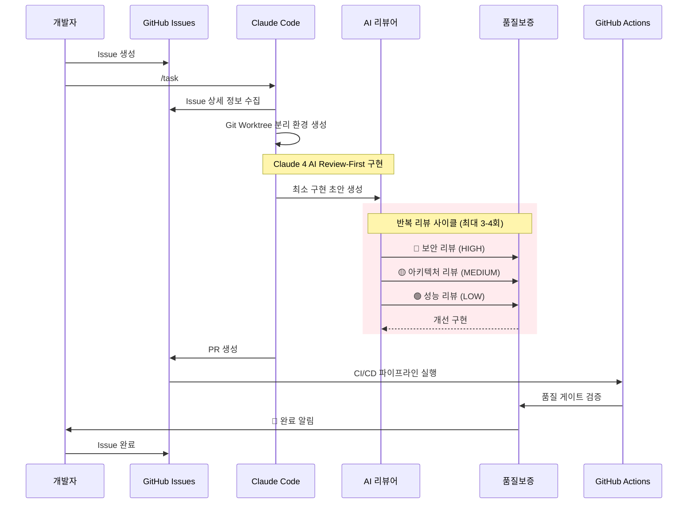
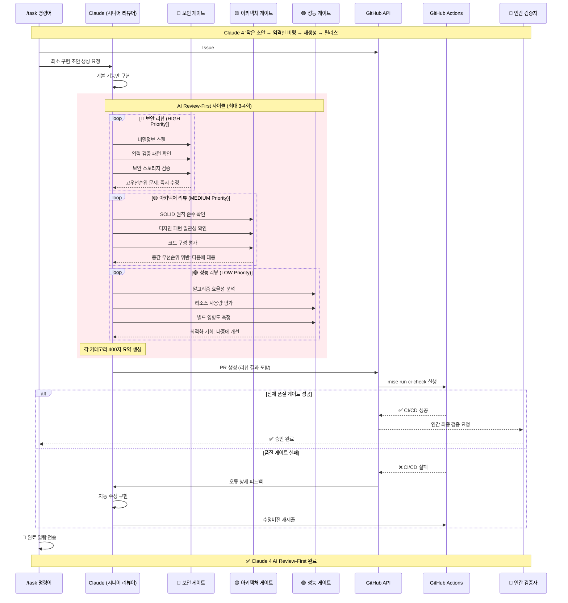

# Flutter Template Project

**CLAUDE.md와 README.md의 1:1 대응에 의한 GitHub Issues 통합 AI 지원 개발 플랫폼**

## 문서 구조와 관계성

이 프로젝트는 AI와 인간 모두에 대응하는 포괄적인 문서 체계를 채택하고 있습니다:

### CLAUDE.md - README.md 통합 시스템



### 문서 구성

| 파일          | 목적                                   | 독자         | 관계성 |
| ------------- | -------------------------------------- | ------------ | ------ |
| **CLAUDE.md** | Claude Code용 워크플로우 설정          | AI 시스템    | ←→     |
| **README.md** | 인간을 위한 프로젝트 설명 (본 문서)    | 개발팀       | ←→     |

**1:1 대응의 원칙**: CLAUDE.md의 각 섹션은 README.md에서 대응하는 인간용 설명을 가집니다.

### 언어 설정

- **기본 언어**: Korean (한국어)
- **README.md 언어**: 기본 언어 설정에 따라 한국어로 작성
- **다국어 지원**: slang i18n 시스템을 통한 확장 가능

## 프로젝트 개요

AI 지원 개발과 모던 아키텍처를 결합한 GitHub Issues 통합 엔터프라이즈 대응 Flutter 애플리케이션 템플릿입니다.

### 핵심 특징

- **🤖 AI 지원 개발**: Claude Code와 GitHub Issues의 통합을 통한 자동 개발
- **📋 GitHub Issues 통합**: 네이티브 GitHub Issue 관리를 통한 효율적인 작업 처리
- **📦 모노레포 구조**: Melos를 통한 효율적인 패키지 관리
- **🎯 타입 안전성**: Riverpod, go_router, slang을 통한 견고한 아키텍처
- **⚡ 개발 효율성**: 자동 코드 생성과 고속 개발 사이클
- **🔍 고도의 품질보증**: AI Review-First 방식을 통한 다단계 품질 관리

## 설정

| 도구    | 추천 버전     | 설치 방법                                  |
| ------- | -------------- | ------------------------------------------- |
| Flutter | mise 관리      | `mise install`                              |
| Bun     | 1.2+           | `curl -fsSL https://bun.sh/install \| bash` |
| Melos   | 7.0+           | `dart pub global activate melos`            |

### 빠른 시작

```bash
# 1. 프로젝트 다운로드
git clone <repository-url>
cd flutter_template_project

# 2. 개발 환경 구축

mise install
eval "$(mise activate bash)"
npm install

melos bootstrap

# 3. GitHub CLI 인증 (필수)
gh auth login

# 4. 환경 변수 설정
export ENABLE_BACKGROUND_TASKS=true
export TASK_MANAGEMENT_SYSTEM=github
export GITHUB_ACTIONS_CHECK=true

# 5. 코드 생성 실행
melos run gen
```

## 아키텍처 개요

### 시스템 구성도



### 기술 스택

| 분야                 | 기술                               | 역할                               |
| ------------------ | -------------------------------- | -------------------------------- |
| **프레임워크**     | Flutter + mise                   | 멀티플랫폼 개발                |
| **상태관리**         | Riverpod + Hooks                 | 리액티브 상태 아키텍처          |
| **네비게이션**     | go_router                        | 타입 안전한 라우팅              |
| **국제화**           | slang                            | 코드 생성을 통한 다국어 지원     |
| **모노레포**         | Melos                            | 패키지 통합 관리                |
| **AI 개발**          | Claude Code + GitHub Issues      | 자동화된 개발 워크플로우       |
| **품질관리**         | AI Review-First + GitHub Actions | 다단계 품질보증 시스템         |

## Claude 4 AI Review-First 개발 워크플로우

### 핵심 원칙: '작은 초안 → 엄격한 비평 → 재생성 → 릴리스'



### GitHub Issues 통합 AI 개발 프로세스



### /task 명령어: Claude 4 AI Review-First 통합

```bash
# 인터렉티브 모드 (추천)
/task
? Select Issues to process: #123, #456

# 직접 실행 모드
/task #123 #456

# Claude 4 AI Review-First 실행 프로세스:
# 🔄 Phase 1: GitHub Issue 상세 정보 수집
# 🔄 Phase 2: Git Worktree 분리 환경 생성
# 🔄 Phase 3: 최소 구현 초안 생성
# 🔄 Phase 4: AI 리뷰 사이클 (3-4회)
#     ├── 🔴 보안 스캔 (HIGH 우선순위)
#     ├── 🟡 아키텍처 검증 (MEDIUM 우선순위)
#     └── 🟢 성능 분석 (LOW 우선순위)
# 🔄 Phase 5: 품질 게이트 검증
# 🔄 Phase 6: GitHub Actions CI/CD 통합
# ✅ Phase 7: 완료 알림 + 인간 최종 검증
```

### Claude 4 리뷰 품질 기준

| 우선순위  | 카테고리        | 평가 항목                                      | 수정 타이밍  |
| --------- | -------------- | -------------------------------------------- | -------------- |
| 🔴 HIGH   | 보안           | 하드코드 비밀정보, 입력 검증, 암호화         | 즉시 수정       |
| 🟡 MEDIUM | 아키텍처       | SOLID 원칙, 디자인 패턴, 코드 구성          | 다음에 대응     |
| 🟢 LOW    | 성능           | 알고리즘 효율성, 리소스 사용, 빌드 최적화   | 나중에 최적화  |

## Claude 4 AI Review-First 품질관리 시스템

### 품질보증 파이프라인: '시니어 리뷰어'로서의 Claude 활용



### Claude 4 품질 기준: 우선순위별 평가 시스템

#### 🔴 보안 기준 (HIGH Priority - 즉시 수정)

**중요 요구사항**:

- ✅ 하드코드된 비밀정보의 완전 제거
  ```bash
  grep -r "API_KEY\|SECRET\|PASSWORD\|TOKEN" lib/  # 비어있어야 함
  ```
- ✅ 입력값 검증 및 살균 처리 구현
- ✅ 보안 데이터 저장소 (SharedPreferences 암호화)
- ✅ HTTPS/TLS 통신 강제
- ✅ 인증 토큰의 적절한 처리
- ✅ 오류 정보 누출 방지

#### 🟡 아키텍처 기준 (MEDIUM Priority - 다음에 대응)

**SOLID 원칙 준수**:

- ✅ **단일 책임**: 각 클래스 단일 책임
- ✅ **개방/폐쇄**: 확장 개방, 수정 폐쇄
- ✅ **리스코프 치환**: 서브타입 치환 가능성
- ✅ **인터페이스 분리**: 인터페이스 분리
- ✅ **의존관계 역전**: 의존관계 역전

**프로젝트 일관성**:

- ✅ Riverpod providers (@riverpod annotation)
- ✅ go_router 타입 안전 네비게이션
- ✅ slang 다국어 지원 구조
- ✅ 적절한 오류 처리

#### 🟢 성능 기준 (LOW Priority - 나중에 최적화)

**효율성 요구사항**:

- ✅ O(n²) 알고리즘을 O(n)으로 최적화
- ✅ Widget 리빌드 최적화 (const, keys 사용)
- ✅ 대규모 데이터셋의 지연 로딩
- ✅ 이미지 최적화 및 캐시 구현
- ✅ 빌드 시간 영향 최소화

### Claude 4 리뷰 사이클 표준

**반복 요구사항**:

- **최대 반복 횟수**: 3-4 사이클
- **요약 제약**: 카테고리별 400자 이내
- **문제 해결 순서**: 🔴 HIGH → 🟡 MEDIUM → 🟢 LOW
- **최종 검증**: 인간 리뷰 필수
- **품질 게이트**: `mise run ci-check` 전체 테스트 성공

**리뷰 출력 형식**:

```text
🔴 보안: [400자 요약 + 구체적 수정 지시]
🟡 아키텍처: [400자 요약 + 개선 제안]
🟢 성능: [400자 요약 + 최적화 방안]
다음 액션: [우선순위별 구체적 절차]
```

## 개발 명령어

### Mise 작업 (추천 통합 인터페이스)

```bash
# 완전한 개발 워크플로우
mise run dev

# 초기 프로젝트 설정
mise run setup

# 코드 품질 워크플로우
mise run quality

# 완전한 CI 워크플로우
mise run ci-check
```

### 개별 Mise 작업

```bash
# 코드 분석 및 테스트
mise run analyze          # 정적 분석 (melos run analyze 호출)
mise run analyze-slang    # 번역 검증 (melos run analyze:slang 호출)
mise run test             # 테스트 실행 (melos run test 호출)

# 코드 포맷팅
mise run format       # 전체 파일 포맷팅 (두 포맷팅 모두 실행)

# 빌드 및 실행
mise run run              # 앱 실행 (디버그) (melos exec --scope=app -- flutter run 호출)

# 유지보수
mise run clean-branch     # Git 브랜치/워크트리 청소 (./scripts/clean-branch.sh 호출)
```

### 레거시 명령어 (계속 이용 가능)

#### Melos 명령어

```bash
melos run gen             # 코드 생성
melos run get             # 의존성 설치
melos run analyze         # 정적 분석
melos run format          # 코드 포맷팅
melos run test            # 테스트 실행
```

#### Bun 명령어

```bash
bun run lint              # YAML/Markdown 린트
bun run format            # YAML/Markdown 포맷팅
bun run clean             # 청소 및 재설치
```

## 프로젝트 구성

```bash
flutter_template_project/
├── 📱 app/                      # 메인 애플리케이션
│   ├── lib/                     # 애플리케이션 코드
│   │   ├── main.dart           # 진입점
│   │   ├── pages/              # UI 페이지
│   │   ├── router/             # go_router 설정
│   │   └── i18n/               # 다국어 지원 파일
│   ├── assets/i18n/            # 번역 JSON 파일
│   └── test/                   # 위젯 테스트
├── 📦 packages/                 # 공유 패키지
├── 🤖 .claude-workspaces/       # AI 개발용 분리 환경
├── ⚙️ .vscode/                  # VS Code IDE 설정
│   └── settings.json           # Flutter 개발용 에디터 설정
├── 📋 CLAUDE.md                 # AI용 프로젝트 설정
├── 📋 README.md                 # 인간용 프로젝트 설명 (본 문서)
├── 🔧 scripts/                 # 자동화 스크립트
├── 🔧 .claude/                 # Claude Code 설정
│   └── commands/
│       └── task.md             # GitHub Issue 처리 명령어
├── 📚 docs/                    # 전용 문서
│   ├── CLAUDE_4_BEST_PRACTICES.md # AI 설계 원칙
│   ├── COMMITLINT_RULES.md     # 커밋 규약
│   └── WORKTREE_ARCHITECTURE.md # 병렬 개발 아키텍처
├── 📄 LICENSE                   # MIT 라이선스
└── 📋 pubspec.yaml              # 워크스페이스 설정
```

## 자동화된 워크플로우

### Workflow 1: 코드 품질보증

**목적**: 전체 개발 활동에서 일관된 코드 품질 보장

**실행 내용**:

1. `melos run analyze` - 정적 분석
2. `melos run ci:format` - 포맷 검증
3. `melos run test` - 자동 테스트
4. `melos run analyze:slang` - 번역 검증

### Workflow 2: 문서 동기화

**목적**: CLAUDE.md와 관련 문서의 일관성 유지

**실행 내용**:

1. 프로젝트 구조 변경 모니터링
2. 자동 업데이트를 통한 구조 섹션 유지
3. Claude 4 Best Practices 준수 검증

### Workflow 3: 개발 환경 검증

**목적**: 적절한 개발 환경 설정과 구성 보장

**실행 내용**:

1. `mise` Flutter 버전 검증
2. GitHub CLI 설정 확인
3. `git worktree` 지원 검증
4. 환경 변수 유효성 확인

## 문서 체계

### 포괄적 문서 구성

| 문서                                                               | 내용             | 대상자       | CLAUDE.md 대응 섹션 |
| ------------------------------------------------------------------ | ---------------- | ----------- | ----------------------- |
| [README.md](README.md)                                             | 프로젝트 개요 | 개발자      | 전체 구성                |
| [CLAUDE.md](CLAUDE.md)                                             | AI 개발 설정       | Claude Code | 전체 구성                |
| [docs/CLAUDE_4_BEST_PRACTICES.md](docs/CLAUDE_4_BEST_PRACTICES.md) | AI 설계 원칙       | AI 개발자    | AI Review-First         |
| [docs/COMMITLINT_RULES.md](docs/COMMITLINT_RULES.md)               | 커밋 규약     | 개발자      | Git Workflow            |
| [docs/PROJECT_OVERVIEW.md](docs/PROJECT_OVERVIEW.md)               | 프로젝트 개요 | 개발자      | 프로젝트 개요        |
| [docs/WORKTREE_ARCHITECTURE.md](docs/WORKTREE_ARCHITECTURE.md)     | 병렬 개발         | AI 개발자    | Git Worktree            |
| [.claude/commands/task.md](.claude/commands/task.md)               | Issue 처리        | Claude Code | 커스텀 명령어        |

### Mermaid 시각화 활용

이 README에서는 다음 요소를 Mermaid 표기법으로 도식화하고 있습니다:

1. **문서 관계도**: CLAUDE.md와 README.md의 1:1 대응 관계
2. **시스템 구성도**: GitHub Issues 통합 아키텍처 전체 조감
3. **AI 개발 플로우도**: GitHub Issues 통합 AI 지원 개발 프로세스 시각화
4. **품질관리 시퀀스도**: AI Review-First 품질보증 프로세스 상세화

## 환경 변수 설정

### 필수 설정

```bash
# Claude Code 기본 설정
export ENABLE_BACKGROUND_TASKS=true
export FLUTTER_VERSION_MANAGEMENT=mise
export TASK_MANAGEMENT_SYSTEM=github

# GitHub 통합 설정
export GITHUB_ACTIONS_CHECK=true
export CHECK_PR_WORKFLOW="check-pr.yml"

# 병렬 개발 설정
export PARALLEL_DEVELOPMENT=git_worktree
export CLAUDE_ISOLATION_MODE=true
export CLAUDE_WORKSPACE_DIR=".claude-workspaces"

# UI 및 알림 설정
export PR_LANGUAGE=korean
export COMPLETION_NOTIFICATION=alarm
export INTERACTIVE_MODE=true
export ISSUE_SELECTION_UI=enabled
```

## 기여 방법

1. 이 리포지토리를 포크
2. 피처 브랜치를 생성 (`git checkout -b feature/ISSUE-123`)
3. 변경사항을 커밋 (`git commit -m 'feat: add new feature [ISSUE-123]'`)
4. 브랜치를 푸시 (`git push origin feature/ISSUE-123`)
5. 풀 리퀀스트를 생성

### 브랜치 명명 규칙

- **형식**: `feature/ISSUE-123` (Issue 번호만)
- **금지**: 한국어/영어 설명문 추가 불가
- **이유**: 자동화된 워크플로우와의 대응

## 라이선스

이 프로젝트는 MIT 라이선스 하에 공개되어 있습니다. 자세한 내용은 [LICENSE](LICENSE)를 참조하세요.

## 지원 및 커뮤니티

- 📖 [문서](docs/)
- 🐛 [Issue 보고](https://github.com/your-org/flutter_template_project/issues)
- 💬 [토론](https://github.com/your-org/flutter_template_project/discussions)
- 🤖 [Claude Code 통합 가이드](.claude/commands/task.md)

---

**CLAUDE.md와 README.md의 1:1 대응을 통해 AI와 인간 모두에게 최적화된 GitHub Issues 통합 개발 환경을 제공합니다.**
