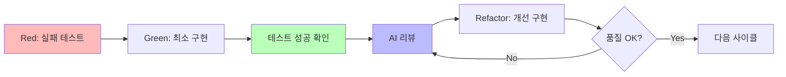

# Claude 4 프롬프트 엔지니어링 베스트 프랙티스

## 목적

Claude 4로 TDD + AI 리뷰 우선 방식을 통한 고품질 코드 개발 실현

## 핵심 요소

1. **TDD + AI 리뷰 우선**: Red-Green-Refactor + AI 비평 사이클
2. **명확하고 구체적인 지시**: 모호함을 배제하고 기대하는 출력을 상세하게 지정
3. **구조화된 리뷰**: 보안 → SOLID → 성능 순서의 우선도

## 구체적 예시: 개발 사이클 실천

### 단계1: Red (실패 테스트 생성)

```typescript
// 30% 테스트: 최소한의 기대값 정의
describe('UserAuth', () => {
  it('올바른 인증정보로 로그인 성공', () => {
    const auth = new UserAuth()
    const result = auth.login('user@example.com', 'password123')
    expect(result.success).toBe(true)
  })
})
```

### 단계2: Green (최소 구현)

Claude 4에 대한 지시:

```
JWT 기반 사용자 인증 기능을 구현해주세요.
테스트를 통과하는 최소한의 구현만: login() 메서드
구현 전략: Fake It → 단계적 일반화
```

### 단계3: Refactor + AI 리뷰

```
테스트 성공 후, 다음 관점에서 코드를 리뷰:

🔴 보안 (높은 우선도):
- 패스워드 해시화
- 토큰 유효기간 검증

🟡 SOLID 원칙 (중간 우선도):
- 단일 책임 원칙 준수
- 의존성 역전 구현

🟢 성능 (낮은 우선도):
- 토큰 생성 효율성

400자 이내로 요약해주세요.
```

---

## 이 가이드에 대해

이 가이드는 Claude 4 모델(Opus 4 및 Sonnet 4)에 특화된 **TDD + AI 리뷰 우선 설계**의 실천 방법을 제공합니다. 기존의 "구현 후 테스트"에서 "테스트 주도 + AI 비평"으로의 전환을 통해 고품질 소프트웨어를 효율적으로 개발할 수 있습니다.

## 参照文献

- [Claude 4 Best Practices (Anthropic공식홈페이지)](https://docs.anthropic.com/en/docs/build-with-claude/prompt-engineering/claude-4-best-practices)
- [AI리뷰 퍼스트 설계 (Zenn_일본어)](https://zenn.dev/caphtech/articles/ai-review-first-design)
- [TEST_DRIVEN_DEVELOPMENT](TEST_DRIVEN_DEVELOPMENT.md)

## 1. 핵심 원칙

### TDD + AI 리뷰 우선 사이클



**"실패 테스트 → 최소 구현 → AI 비평 → 개선 → 릴리스"**

### Claude 4에 대한 효과적인 지시 방법

#### ❌ 효과가 낮은 예시

```
좋은 코드를 작성해
```

#### ✅ 효과적인 예시

```
Riverpod을 사용해서 사용자 설정 화면을 생성해주세요.
요구사항:
- ThemeMode 전환(light/dark/system)
- SharedPreferences로 영속화
- Material Design 3 준수
- slang을 통한 다국어 지원

제약사항:
- F.I.R.S.T. 원칙을 따른 테스트 포함
- SOLID 원칙 준수
```

## 2. 구현 전략

### Flutter 프로젝트에서의 실천 절차

1. **Red**: 30% 테스트에서 시작(5분 이내)
2. **Green**: Claude 4에 최소 구현 요청(10분 이내)
3. **AI 리뷰**: 구조화된 리뷰 템플릿 사용(5분 이내)
4. **Refactor**: 우선순위에 따라 문제 수정(10분 이내)
5. **품질 확인**: `melos run test && melos run analyze`

### 구조화된 리뷰 템플릿

```yaml
review_request:
  code: '[리뷰 대상 코드]'

  evaluation_criteria:
    security:
      priority: 'HIGH'
      items:
        - '하드코딩된 비밀 정보'
        - '입력값 검증 구현'
        - '보안 저장 방법'

    architecture:
      priority: 'MEDIUM'
      items:
        - 'SOLID 원칙 준수'
        - '책임 분리'
        - '확장성 고려'

    performance:
      priority: 'LOW'
      items:
        - '알고리즘 효율성'
        - '리소스 사용량'

  output_format: '400자 이내로 각 카테고리별 요약'
```

## 3. 고급 기법

### 병렬 도구 사용 최적화

```
여러 파일 조사 시:
- 관련 파일을 동시에 로드
- 독립 검색을 병렬 실행
- 대기 시간 최소화
```

### 컨텍스트 포함 지시

❌ 피할 것:

```
생략 기호를 사용하지 마
```

✅ 추천:

```
음성 읽기 지원을 위해 생략 기호(...)를 피하고,
"등" "기타" 같은 명확한 표현을 사용해주세요.
```

### XML 형식의 출력 제어

```xml
<implementation>
  <summary>구현 개요</summary>
  <code>구체적인 코드</code>
  <tests>해당 테스트</tests>
  <security_notes>보안 고려사항</security_notes>
</implementation>
```

## 4. 흔히 발생하는 함정과 회피 방법

### 모호한 지시 회피

| 피해야 할 지시         | 개선된 지시                                                                                            |
| ---------------------- | --------------------------------------------------------------------------------------------------------- |
| "함수를 생성해"     | "JWT 인증용 함수를 생성. 보안 베스트 프랙티스를 따라 적절한 에러 핸들링을 포함해주세요" |
| "테스트를 작성하지 마" | "구현된 코드에 대한 위젯 테스트를 작성해주세요"                                          |

### 테스트 편중 회피

```
요구사항: 범용적인 솔루션 개발
- 모든 유효 입력에 대응
- 하드코딩 회피
- 예외 상황 고려
- 확장성 중시

피해야 할 것:
- 특정 테스트 케이스만 대응
- 매직 넘버 사용
```

## 5. 품질 기준과 체크리스트

### TDD 품질 기준

```yaml
tdd_quality_check:
  red_phase:
    - [ ] 테스트 실패 확인(Red 실행 결과)
    - [ ] 단일 책임에 집중
    - [ ] 구현 없이 의도 이해 가능

  green_phase:
    - [ ] 테스트 성공 확인(Green 실행 결과)
    - [ ] 최소 변경으로 구현
    - [ ] 적절한 구현 전략 선택

  refactor_phase:
    - [ ] 지속적 테스트 성공
    - [ ] AI 리뷰 문제 수정
    - [ ] 중복 코드 제거
```

### 품질 게이트

```bash
# 필수 체크
melos run test     # 모든 테스트 성공
melos run analyze  # 정적 분석 통과

# 추천 체크
melos run analyze-slang  # 번역 검증
mise run format      # 코드 정렬
```

## 요약

**오늘부터 실행할 수 있는 3단계:**

1. **30% 테스트 작성**(5분): 단일 동작 테스트
2. **Claude 4 구현 요청**(10분): 구조화된 명확한 지시
3. **AI 리뷰 실시**(5분): 🔴→🟡→🟢의 우선순위

**핵심 가치:** "테스트 주도 + AI 비평"을 통해 두려움 없이 변경할 수 있는 신뢰성 높은 코드를 효율적으로 개발한다.

처음에는 30%의 완성도로 충분합니다. 실패 테스트에서 시작하는 것이 TDD + AI 리뷰 우선의 첫번째 단계입니다.
