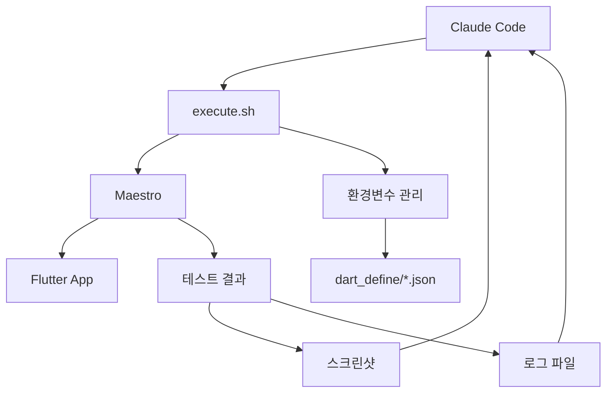

# Claude Code × Maestro UI테스트 워크플로우

본 문서에서는 Claude Code와 Maestro를 결합한 Flutter UI테스트의 종합적인 워크플로우에 대해 설명합니다. 이 접근법은 반복적인 UI 개발 프로세스를 효율화하고, 고품질 모바일 애플리케이션 개발을 지원합니다.

## 개요

### 워크플로우의 특징

- **AI 주도의 반복 개발**: Claude Code가 실패를 분석하고 개선책을 제안
- **실패 전제의 설계**: 테스트 실패를 학습의 기회로 활용
- **자동화된 디버깅**: 스크린샷과 로그를 통한 시각적 문제 분석
- **환경변수의 동적 관리**: flavor에 따른 유연한 테스트 실행

### 기술 스택



## 기본 워크플로우

### 페이즈1: 요구사항 분석과 테스트 설계

#### Claude Code에 의한 요구사항 이해

```
사용자: "카운터 앱의 증가 기능을 테스트하고 싶습니다"

Claude Code 분석 항목:
1. 필요한 UI 요소의 식별
2. 기대되는 동작의 이해
3. 테스트 관점의 도출
4. 기존 테스트와의 관련성 확인
```

#### 테스트 설계 원칙

1. **단일 책임**: 1개의 테스트로 1개의 기능을 테스트
2. **환경 비의존**: `${FULL_APP_ID}` 등의 동적 변수를 사용
3. **가독성 중시**: 이해하기 쉬운 어설션과 단계명
4. **유지보수성**: 향후 변경에 대응할 수 있는 구조

### 페이즈2: 테스트 구현

#### 현대적인 Maestro 테스트 템플릿

```yaml
# 기본 템플릿
appId: ${FULL_APP_ID}
---
- launchApp
- waitForAnimationToEnd
- assertVisible: '기대하는 UI 요소'
- tapOn:
    text: '버튼 텍스트'
- assertVisible: '결과 상태'
```

#### 실습 예: 카운터 앱 테스트

```yaml
# counter_test.yaml
appId: ${FULL_APP_ID}
---
- launchApp
- assertVisible: 'Flutter Demo Home Page'
- assertVisible: '카운터: 0'
- tapOn:
    text: 'Increment'
- assertVisible: '카운터: 1'
- tapOn:
    text: 'Increment'
- assertVisible: '카운터: 2'
```

### 페이즈3: 테스트 실행과 디버깅

#### execute.sh를 통한 실행

```bash
# 기본 실행
./execute.sh counter_test.yaml

# 디버그 모드
./execute.sh --verbose --debug counter_test.yaml

# 워치 모드 (개발 중)
./execute.sh --watch counter_test.yaml
```

#### 출력 예와 해석

```
===== MAESTRO UI TEST RUNNER =====
[INFO] Flavor: development
[INFO] YAML file: counter_test.yaml
[INFO] Environment variables: FLAVOR=development, APP_ID=com.example.app, FULL_APP_ID=com.example.app.development

===== EXECUTING MAESTRO TEST =====
[INFO] Test artifacts will be saved to: test-output/20240703-123456
```

### 페이즈4: 실패 분석과 개선

#### Claude Code에 의한 실패 분석 프로세스

**1. 로그 분석**

```bash
# 최신 테스트 출력 확인
cat test-output/[최신 타임스탬프]/maestro-output.log
```

**2. 스크린샷 분석**

```
Maestro가 자동 생성하는 스크린샷 확인
위치: ~/.maestro/tests/[테스트 실행ID]/
```

**3. 일반적인 실패 패턴**

| 실패 타입         | 증상                | Claude Code 대응                                  |
| ------------------ | ------------------- | ------------------------------------------------ |
| 요소를 찾을 수 없음 | `Element not found` | UI 요소의 ID나 텍스트 확인, 적절한 선택자로 수정 |
| 앱 시작 실패     | `App launch failed` | FULL_APP_ID 확인, 디바이스 연결 상태 점검      |
| 타임아웃       | `Timeout`           | 대기 시간 조정, 명시적 대기 조건 추가             |
| 애니메이션 간섭 | UI 요소 상태 불일치  | `waitForAnimationToEnd` 추가                    |

### 페이즈5: 지속적 개선

#### 워치 모드에서의 반복 개발

```bash
# 파일 변경을 모니터링하여 자동 재실행
./execute.sh --watch counter_test.yaml
```

```
[INFO] Monitoring file changes for: counter_test.yaml
[INFO] Press Ctrl+C to exit watch mode

# 파일 저장 시
[INFO] File changed, running test...
[실행 결과]
[INFO] Waiting for file changes...
```

## 환경변수 관리 시스템

### 동적 변수 생성의 구조

#### 패턴1: ID + SUFFIX 조합

```json
{
  "APP_ID": "com.example.app",
  "APP_ID_SUFFIX": ".development"
}
```

→ `FULL_APP_ID=com.example.app.development`

#### 패턴2: PREFIX + SUFFIX 조합

```json
{
  "API_PREFIX": "https://api.staging",
  "API_SUFFIX": ".example.com"
}
```

→ `FULL_API=https://api.staging.example.com`

### Flavor별 환경 전환

#### 설정 파일 구조

```
app/.dart_define/
├── development.json    # 개발 환경
├── staging.json       # 스테이징 환경
└── production.json    # 운영 환경
```

#### Flavor별 테스트 실행

```bash
# 개발 환경 (기본값)
./execute.sh counter_test.yaml

# 스테이징 환경
./execute.sh --flavor staging counter_test.yaml

# 운영 환경
./execute.sh --flavor production counter_test.yaml
```

## 실습적인 워크플로우 예

### 시나리오: 새 기능 "즐겨찾기 버튼" 테스트 작성

#### 1. 요구사항 확인

```
기능: 상품 상세 화면에 즐겨찾기 버튼 추가
동작: 버튼 탭으로 상태가 전환되고, 하트 아이콘이 변화
테스트 관점: 초기 상태, 즐겨찾기 추가, 즐겨찾기 삭제
```

#### 2. Claude Code에 의한 테스트 작성

```yaml
# favorite_button_test.yaml
appId: ${FULL_APP_ID}
---
# 상품 상세 화면으로 이동
- launchApp
- tapOn:
    text: 'Products'
- tapOn:
    text: 'First Product'

# 즐겨찾기 버튼 테스트
- assertVisible: 'Product Details'
- assertVisible:
    id: 'favorite_button'

# 초기 상태 확인 (즐겨찾기 아님)
- assertVisible:
    id: 'favorite_icon_empty'

# 즐겨찾기에 추가
- tapOn:
    id: 'favorite_button'
- waitForAnimationToEnd
- assertVisible:
    id: 'favorite_icon_filled'

# 즐겨찾기에서 삭제
- tapOn:
    id: 'favorite_button'
- waitForAnimationToEnd
- assertVisible:
    id: 'favorite_icon_empty'
```

#### 3. 실행과 디버깅

```bash
# 첫 실행 (실패 예상)
./execute.sh --verbose favorite_button_test.yaml

# 실패 내용 분석
# → 스크린샷으로 UI 확인
# → 로그로 오류 상세 확인
# → Claude Code가 문제점을 식별

# 수정과 재실행
./execute.sh favorite_button_test.yaml
```

#### 4. 지속적 개선

```bash
# 워치 모드로 개발 지속
./execute.sh --watch favorite_button_test.yaml

# 테스트 성공 후, 다른 케이스도 추가
# - 복수 상품에서의 테스트
# - 네트워크 오류 시의 동작
# - 앱 재시작 후 상태 유지
```

## 고급 테스트 패턴

### 복잡한 UI 플로우 테스트

#### 사용자 등록부터 로그인까지의 일련의 플로우

```yaml
# user_registration_flow_test.yaml
appId: ${FULL_APP_ID}
---
# 앱 시작
- launchApp

# 등록 화면으로 이동
- tapOn:
    text: 'Sign Up'

# 필요 정보 입력
- tapOn:
    id: 'email_field'
- inputText: 'test@example.com'

- tapOn:
    id: 'password_field'
- inputText: 'password123'

- tapOn:
    id: 'confirm_password_field'
- inputText: 'password123'

# 이용약관 동의
- tapOn:
    id: 'terms_checkbox'

# 등록 실행
- tapOn:
    text: 'Create Account'

# 등록 완료 확인
- waitForAnimationToEnd
- assertVisible: 'Registration Successful'

# 로그인 화면으로 이동
- tapOn:
    text: 'Login'

# 로그인 실행
- inputText:
    text: 'test@example.com'
    id: 'login_email_field'

- inputText:
    text: 'password123'
    id: 'login_password_field'

- tapOn:
    text: 'Login'

# 대시보드 표시 확인
- waitForAnimationToEnd
- assertVisible: 'Welcome Dashboard'
```

### 오류 처리 테스트

#### 네트워크 오류 시 동작 테스트

```yaml
# network_error_test.yaml
appId: ${FULL_APP_ID}
---
# 앱 시작
- launchApp

# 네트워크 필수 기능에 액세스
- tapOn:
    text: 'Sync Data'

# 오류 상태 확인
- waitForAnimationToEnd:
    timeout: 10000

# 오류 메시지 표시 확인
- assertVisible: 'Network Error'
- assertVisible: 'Please check your connection'

# 재시도 버튼 테스트
- tapOn:
    text: 'Retry'

# 재시도 후 상태 확인
- waitForAnimationToEnd:
    timeout: 5000
```

## 디버깅과 트러블슈팅

### 자주 발생하는 문제와 해결 패턴

#### 1. 요소를 찾을 수 없는 문제

**문제 식별**

```
Assertion '"버튼"' failed. Element not found.
```

**Claude Code에 의한 해결 절차**

1. 스크린샷으로 UI 상태 확인
2. Flutter 코드에서 요소의 ID나 텍스트 확인
3. 타이밍 문제인지 판단
4. 적절한 선택자로 수정

**수정 예**

```yaml
# 수정 전 (텍스트가 정확하지 않음)
- tapOn: '버튼'

# 수정 후 (정확한 텍스트 또는 ID 사용)
- tapOn:
    text: 'Increment'
# 또는
- tapOn:
    id: 'increment_button'
```

#### 2. 타이밍 문제

**증상**

```
애니메이션 중에 탭해서 실패
로딩 중에 요소를 찾아서 실패
```

**해결책**

```yaml
# 애니메이션 완료 대기
- waitForAnimationToEnd

# 명시적 요소 대기
- waitUntilVisible:
    text: 'Content Loaded'
    timeout: 10000

# 장시간 처리 대기
- extendedWaitUntilVisible:
    element: 'Processing Complete'
    timeout: 30000
```

#### 3. 앱 시작 문제

**문제 식별**

```bash
# 앱ID 확인
./execute.sh --dry-run counter_test.yaml

# 출력 예
Would execute: maestro test --env FULL_APP_ID=com.example.app.development counter_test.yaml
```

**해결 절차**

1. 디바이스/시뮬레이터에서의 앱 설치 상황 확인
2. FULL_APP_ID가 올바른지 확인
3. 앱의 빌드와 설치 상태 확인

### execute.sh의 디버그 옵션

#### 상세 로그 출력

```bash
# 기본적인 상세 출력
./execute.sh --verbose counter_test.yaml

# Maestro의 디버그 출력도 포함
./execute.sh --debug counter_test.yaml

# 실행 전 확인 (드라이런)
./execute.sh --dry-run counter_test.yaml

# 구문 검사만
./execute.sh --validate-only counter_test.yaml
```

#### 출력 파일의 분석

```bash
# 최신 테스트 결과 디렉토리 표시
ls -la test-output/ | tail -1

# 로그 파일 내용 확인
cat test-output/[타임스탬프]/maestro-output.log

# 오류 행만 추출
grep -i "error\|failed\|exception" test-output/[타임스탬프]/maestro-output.log
```

## 베스트 프랙티스

### 테스트 설계 원칙

#### 1. 적절한 세분화

```yaml
# ✅ 좋은 예: 단일 기능 테스트
# login_test.yaml - 로그인 기능만 테스트
appId: ${FULL_APP_ID}
---
- launchApp
- tapOn: 'Login'
- inputText:
    text: 'user@example.com'
    id: 'email_field'
- inputText:
    text: 'password'
    id: 'password_field'
- tapOn: 'Login Button'
- assertVisible: 'Dashboard'
# ❌ 나쁜 예: 복수 기능을 하나의 테스트에서
# 등록→로그인→상품 조회→구매까지 하나의 테스트에서 실행
```

#### 2. 유지보수성 확보

```yaml
# ✅ 좋은 예: 이해하기 쉬운 단계명
- assertVisible: '사용자명 입력 필드'
- inputText:
    text: 'test_user'
    id: 'username_field'

# ❌ 나쁜 예: 불분명한 선택자
- tapOn:
    point: '50%,60%'
- inputText: 'test'
```

#### 3. 환경변수 활용

```yaml
# ✅ 좋은 예: 동적 변수 사용
appId: ${FULL_APP_ID}

# JavaScript 내에서의 환경변수 활용
- evalScript: |
    const apiUrl = maestro.env.FULL_API;
    output.testUrl = apiUrl + '/test';

# ❌ 나쁜 예: 하드코딩
appId: com.example.app.development
```

### CI/CD 통합을 위한 고려사항

#### GitHub Actions와의 연계

```yaml
# .github/workflows/ui-tests.yml에서의 활용 예
- name: Run UI Tests
  run: |
    cd app/test/maestro
    ./execute.sh --no-continue counter_test.yaml
    ./execute.sh --no-continue login_test.yaml
```

#### 테스트 결과 저장

```bash
# CI 환경에서의 아티팩트 저장
cp -r test-output/ $GITHUB_WORKSPACE/ui-test-artifacts/
```

## 정리

Claude Code × Maestro 워크플로우는 다음 가치를 제공합니다:

### 개발 효율성 향상

- **자동화된 문제 분석**: Claude Code가 실패 원인을 식별하고 해결책을 제안
- **반복적 개선**: 워치 모드를 통한 즉각적인 피드백 루프
- **환경 통일**: dart_define 설정을 통한 일관된 환경 관리

### 품질 보증의 강화

- **시각적 검증**: 스크린샷을 통한 UI 상태 확인
- **포괄적 테스트**: 복수 시나리오와 오류 케이스의 커버
- **회귀 방지**: 지속적인 테스트 실행을 통한 품질 유지

### 팀 협업의 촉진

- **표준화된 프로세스**: 통일된 테스트 작성·실행 절차
- **지식 공유**: 문서화된 베스트 프랙티스
- **자동화**: 수동 테스트로부터의 탈출

이 워크플로우를 활용함으로써 고품질의 Flutter 애플리케이션을 효율적으로 개발할 수 있습니다.