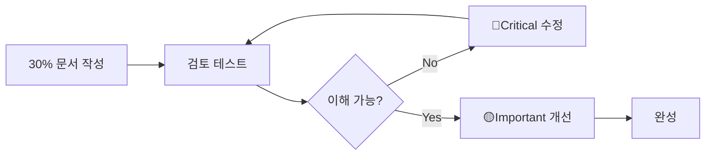
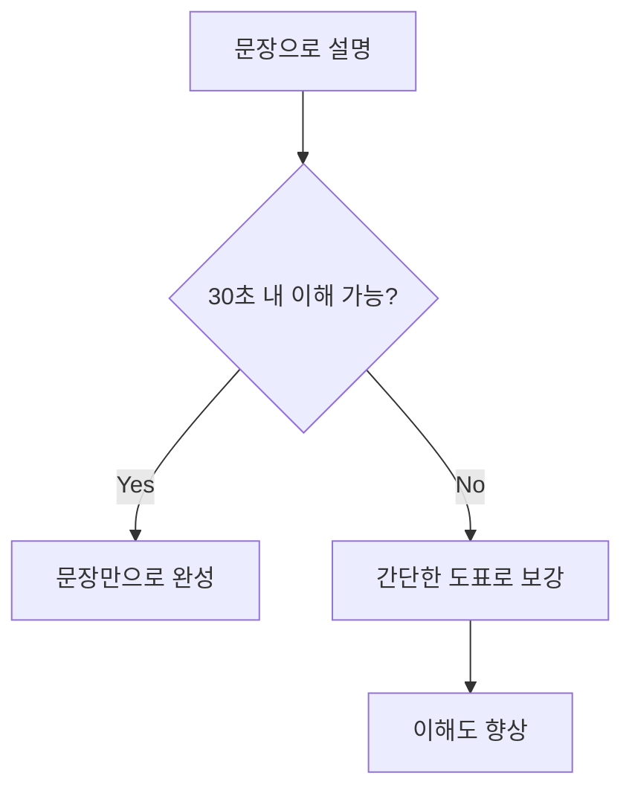
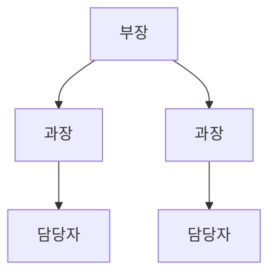
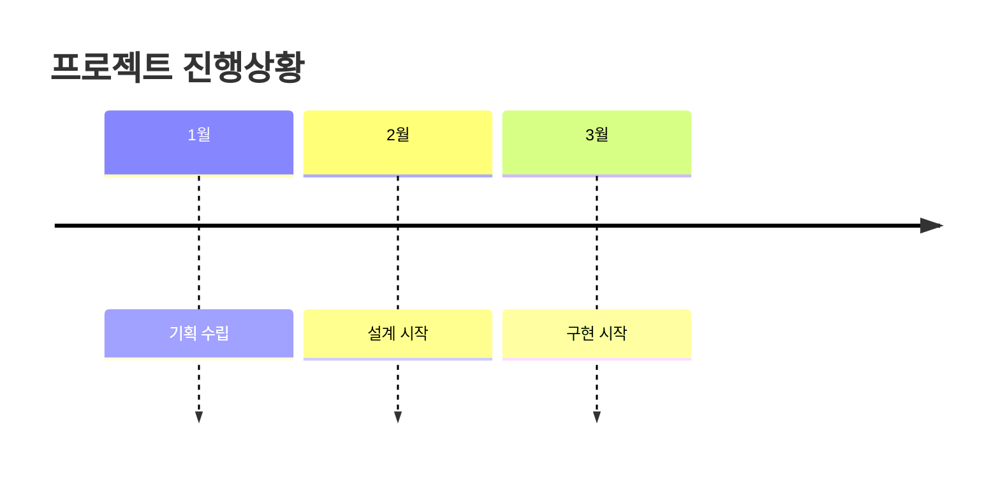

# 문서 작성 가이드라인

## 목적

**30분 내에 실용적인 문서를 작성하여 독자에게 가치를 제공하는** 범용 가이드라인입니다.

**문장만으로는 이해가 어려운 경우, 도표로 보강합니다.** 단, 도표는 필수가 아니며, 30% 문서는 문장만으로도 충분히 가치가 있습니다.

## 최소 절차 (지금 바로 실행)

1. **30% 문서 작성**: 목적·요점·구체적 예시만으로 시작 (30분 이내)
2. **5분 검토**: 타인에게 읽어보게 하여 이해도 확인
3. **문제 수정**: 🔴이해 저해 → 🟡실용성 → 🟢외관 순으로

## 문서 종류별 템플릿

### 설명 문서 (기술 문서, 매뉴얼 등)

```markdown
# [대상] 사용법

## 목적

[독자가 달성하고자 하는 것을 1문장, 20자 이내로]

## 절차

1. [최초 조작]
2. [최소 필요 설정]
3. [확인 방법]

## 예시

[실제로 시도해볼 수 있는 구체적 예시]
```

### 제안 문서 (기획서, 개선 제안 등)

```markdown
# [제안명]

## 목적

[해결하고자 하는 과제를 1문장으로]

## 제안 내용

1. [현재 문제점]
2. [해결책 개요]
3. [기대 효과]

## 구체적 예시

[실행 이미지·사례]
```

### 보고 문서 (진행 보고, 조사 결과 등)

```markdown
# [보고 대상]에 관한 보고

## 목적

[보고 목적을 1문장으로]

## 요점

1. [가장 중요한 결과/진행상황]
2. [과제·문제점]
3. [다음 액션]

## 상세내용

[데이터·구체적 내용]
```

---

## 핵심 원칙: Draft-Test-Refactor



**용어 설명:**

- **30% 문서**: 목적·요점·구체적 예시만 포함한 최소 문서
- **Draft-Test-Refactor**: 작게 만들어서 검토를 통해 개선하는 사이클

---

## 1. 품질 기준 (우선순위 순)

### 🔴 Critical (이해가능성)

- [ ] 목적을 30초 내에 이해할 수 있다
- [ ] 첫 번째 요점을 파악할 수 있다
- [ ] 전문용어에 설명이 있다

### 🟡 Important (실용성)

- [ ] 구체적 예시가 현실적이고 참고가 된다
- [ ] 문제 발생 시 대처법이 있다
- [ ] 예상 독자 수준에 적합하다

### 🟢 Nice (표현)

- [ ] 표기가 통일되어 있다
- [ ] 제목 계층이 적절하다
- [ ] 도표가 효과적으로 배치되어 있다

---

## 2. 도표를 통한 이해도 향상 (옵션)

### 도표 활용 판단 기준

**문장으로 이해가 어려운 경우에만 도표 추가**



### 문서 종류별 도표 활용 예시

| 문서 종류  | 적합한 도표                  | 예시               |
| ---------- | ---------------------------- | ------------------ |
| 절차 설명  | 플로우차트                   | 신청 절차 흐름     |
| 조직·관계  | 조직도, 관계도               | 부서 구성, 책임 범위 |
| 시계열     | 간트차트, 타임라인           | 프로젝트 진행상황  |
| 비교 분석  | 표, 그래프                   | 비용 대비 효과 비교 |

### 간단한 도표 만들기

**기본적인 도표 패턴 (기억하기 쉬운 3가지)**

````markdown
# 절차·흐름 설명용


````

# 조직·관계 설명용



# 시계열 설명용



---

## 3. 자주 발생하는 문제와 대처법

### 문제1: "무엇부터 써야 할지 모르겠다"

**대처법:** 문서 종류별 템플릿부터 시작

```markdown
목적: [1문장]
요점: [3항목 이내]
구체적 예시: [1개 이상]
```

### 문제2: "완벽을 추구하게 된다"

**대처법:** 시간 제한 설정 (30분 내 작성 완료)

### 문제3: "검토가 미흡하다"

**대처법:** 타인에게 5분간 읽어보게 하여 "이해했는가?" 확인

### 문제4: "기술적이지 않은 문서에서 도표 활용 방법을 모르겠다"

**대처법:** 조직도, 플로우차트, 표부터 시작 (Mermaid 외 도구도 활용)

---

## 4. 실천 체크리스트

### 작성 시 (30분 이내)

- [ ] 목적을 1문장으로 기재
- [ ] 요점을 3항목 이내로 기재
- [ ] 구체적 예시를 1개 이상 기재
- [ ] 30분 내 작성 완료
- [ ] 도표는 이해 어려운 부분에만 추가 (옵션)

### 검토 시 (10분 이내)

- [ ] 목적을 30초 내에 이해할 수 있는가
- [ ] 요점이 명확히 전달되는가
- [ ] 전문용어를 이해할 수 있는가
- [ ] 구체적 예시가 참고가 되는가

### 개선 시 (문제 우선순위 순)

- [ ] 🔴Critical 문제를 즉시 수정
- [ ] 🟡Important 문제를 다음에 개선
- [ ] 🟢Nice 문제를 마지막에 조정

---

## 5. 문서 목적별 활용 지침

### 설명 목적 (이해시키기)

- **중점**: 이해하기 쉬움, 구체적 예시 충실
- **도표**: 절차 플로우, 개념도
- **체크**: 전문용어 설명, 단계적 구성

### 설득 목적 (행동하게 하기)

- **중점**: 근거 명확화, 장점 구체화
- **도표**: 비교표, 효과 그래프
- **체크**: 반대 의견 배려, 실현 가능성

### 기록 목적 (정보 보관)

- **중점**: 사실 정확성, 검색 용이성
- **도표**: 데이터표, 타임라인
- **체크**: 일시·담당자 명기, 업데이트 이력

### 지시 목적 (실행하게 하기)

- **중점**: 명확성, 실행 가능성
- **도표**: 절차 플로우, 체크리스트
- **체크**: 애매한 표현 배제, 완료 조건 명시

---

## 요약

**오늘부터 실행할 수 있는 3단계:**

1. **30% 문서 작성** (30분): 목적·요점·구체적 예시만
2. **5분 검토**: 타인에 의한 이해도 확인
3. **우선순위 수정**: 🔴→🟡→🟢 순으로 개선

**처음에는 30% 완성도면 충분합니다. 도표는 이해를 돕는 도구이며, 필수가 아닙니다. 어떤 종류의 문서든 독자의 피드백이 문서를 가치 있는 것으로 키워줍니다.**