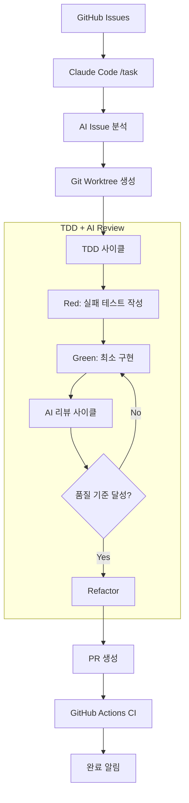
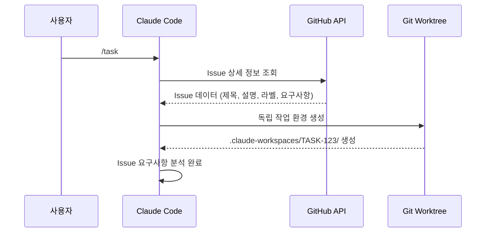

# GitHub Issues AI 자동화 시스템 사용법 가이드

## 프로젝트 개요

이 프로젝트는 **GitHub Issues를 AI 기반으로 자동 처리하는 혁신적인 개발 시스템**입니다. Claude Code와 통합되어 Issue를 자동으로 분석하고, 코드를 생성하며, AI 리뷰를 통해 고품질 구현을 제공합니다.

### 🎯 핵심 기능

- **🤖 AI 기반 Issue 자동 처리**: GitHub Issues를 읽고 자동으로 코드 구현
- **📋 GitHub 완전 통합**: gh CLI를 통한 네이티브 GitHub 연동
- **🔄 TDD + AI Review-First**: 테스트 우선 개발 + AI 단계별 리뷰
- **🌿 Git Worktree 분리**: 각 Issue마다 독립된 작업 환경
- **⚡ 자동화된 품질 보증**: 보안 → 아키텍처 → 성능 순 AI 리뷰
- **🔔 완료 알림**: 작업 완료 시 자동 알림

## 시스템 아키텍처



## 시작하기

### 1. 환경 설정

#### 필수 도구 설치

```bash
# 1. GitHub CLI 설치 및 인증 (필수!)
# macOS
brew install gh

# Ubuntu/Debian
sudo apt install gh

# 인증
gh auth login

# 2. Claude Code 활성화
# Claude Code가 설치되어 있어야 합니다
# https://claude.ai/code

# 3. 환경변수 설정 (중요!)
export ENABLE_BACKGROUND_TASKS=true
export TASK_MANAGEMENT_SYSTEM=github
export GITHUB_ACTIONS_CHECK=true
export CLAUDE_ISOLATION_MODE=true
export CLAUDE_WORKSPACE_DIR=".claude-workspaces"
export PR_LANGUAGE=korean
export COMPLETION_NOTIFICATION=alarm
export INTERACTIVE_MODE=true
export ISSUE_SELECTION_UI=enabled
```

#### 프로젝트 초기 설정

```bash
# 1. 프로젝트 클론
git clone <repository-url>
cd github-issue-sample

# 2. GitHub 레포지토리 연결 확인
gh repo view

# 3. 브랜치 권한 확인
gh auth status

# 4. 이슈 목록 확인 (테스트)
gh issue list
```

### 2. 핵심 기능: /task 명령어

#### **인터랙티브 모드 (권장)**

```bash
/task
```

**실행 과정:**
1. 📋 GitHub에서 내가 할당된 Issue 목록 자동 조회
2. 🎯 카테고리별 분류 (Feature/Bug/Enhancement)  
3. ✅ 다중 선택 UI로 처리할 Issue들 선택
4. 🤖 각 Issue마다 AI 기반 자동 처리 시작

#### **직접 지정 모드**

```bash
/task #123 #456
```

**실행 과정:**
1. 🚀 확인 없이 즉시 해당 Issue들 처리 시작
2. ⚡ 백그라운드에서 병렬 처리
3. 🔔 완료 시 알림 전송

## AI 자동 처리 워크플로우

### Phase 1: Issue 분석 및 환경 구성 (3분)



**자동 수행 작업:**
- GitHub Issue 메타데이터 분석 (제목, 라벨, 설명)
- 요구사항 추출 및 구조화
- Git worktree로 격리된 작업 환경 생성
- 브랜치 자동 생성 (`feature/ISSUE-123`)

### Phase 2: TDD Red - 실패 테스트 작성 (5분)

```bash
# AI가 자동으로 수행하는 작업
✅ Issue 요구사항을 테스트 케이스로 변환
✅ F.I.R.S.T. 원칙 준수 (Fast, Independent, Repeatable, Self-validating, Timely)
✅ 실패하는 테스트 먼저 작성
✅ 테스트 실행하여 Red 상태 확인
```

### Phase 3: TDD Green - 최소 구현 (10분)

```bash
# AI 구현 전략 선택
✅ Obvious Implementation: 명확한 구현
✅ Fake It: 하드코딩 후 일반화  
✅ Triangulation: 여러 테스트로 추상화 유도

# 품질 게이트
✅ 모든 테스트 통과 (Green 상태)
✅ 최소한의 코드 변경
✅ 과도한 설계 방지
```

### Phase 4: AI Review-First 리팩토링 (15분, 3-4회 반복)

#### **🔴 보안 리뷰 (HIGH Priority - 즉시 수정)**

```bash
AI 자동 검사:
✅ 하드코딩된 API 키, 비밀번호 스캔
✅ 입력값 검증 및 새니타이징
✅ 보안 저장소 패턴 (암호화, 키체인)
✅ HTTPS/TLS 통신 강제
✅ 인증 토큰 적절 처리
```

#### **🟡 아키텍처 리뷰 (MEDIUM Priority - 다음 대응)**

```bash
SOLID 원칙 자동 검증:
✅ Single Responsibility: 단일 책임
✅ Open/Closed: 확장 개방, 수정 폐쇄
✅ Liskov Substitution: 하위타입 대체 가능
✅ Interface Segregation: 인터페이스 분리
✅ Dependency Inversion: 의존관계 역전
```

#### **🟢 성능 리뷰 (LOW Priority - 나중 최적화)**

```bash
성능 자동 분석:
✅ 알고리즘 복잡도 (O(n²) → O(n) 개선)
✅ 메모리 사용량 최적화
✅ 네트워크 요청 효율성
✅ 빌드 시간 영향도 측정
```

### Phase 5: PR 생성 및 CI/CD (5분)

```bash
자동화된 마무리:
✅ 변경사항을 feature 브랜치에 커밋
✅ GitHub PR 자동 생성 (템플릿 포함)
✅ GitHub Actions CI/CD 실행
✅ 품질 게이트 통과 검증
✅ Issue에 진행상황 업데이트
✅ 완료 알림 전송 🔔
```

## 실제 사용 시나리오

### 시나리오 1: 새 기능 구현

```bash
# 1. GitHub에서 Feature Issue 생성
# 제목: "사용자 프로필 페이지 추가"
# 라벨: enhancement, feature

# 2. Claude Code에서 처리
/task #789

# 3. AI가 자동 수행
✅ Issue 분석: "사용자 프로필 페이지가 필요함"
✅ 테스트 작성: 프로필 렌더링, 데이터 로딩 테스트
✅ 구현: 최소 기능 프로필 페이지
✅ 리뷰: 보안(인증), 아키텍처(컴포넌트 구조), 성능(렌더링 속도)
✅ PR 생성: "feat: add user profile page #789"
```

### 시나리오 2: 버그 수정

```bash
# 1. Bug Issue 존재
# 제목: "로그인 버튼 클릭 시 오류 발생"
# 라벨: bug, critical

# 2. 자동 처리
/task #456

# 3. AI 수행 과정
✅ 버그 재현 테스트 작성
✅ 원인 분석 및 최소 수정
✅ 보안 검토 (인증 관련 버그)
✅ 회귀 테스트 추가
✅ 수정 PR 생성
```

### 시나리오 3: 다중 Issue 병렬 처리

```bash
# 여러 Issue 동시 선택
/task
? Select Issues: 
  ✅ #123 feat: Add dark mode toggle
  ✅ #124 fix: Memory leak in image loader  
  ✅ #125 docs: Update API documentation

# 각각 독립된 워크트리에서 동시 진행:
# .claude-workspaces/TASK-123/ (Dark mode 구현)
# .claude-workspaces/TASK-124/ (메모리 누수 수정)
# .claude-workspaces/TASK-125/ (문서 업데이트)
```

## 고급 설정

### 환경변수 커스터마이징

```bash
# 작업 모드 설정
export AUTO_CONFIRM_WITH_ARGS=true      # 인수 있을 때 자동 확인
export SILENT_MODE_WITH_ARGS=false      # 진행상황 계속 표시
export ERROR_ONLY_OUTPUT=false          # 에러 외 출력도 표시

# GitHub Actions 통합
export GITHUB_ACTIONS_CHECK=true        # GitHub Actions 완료 확인
export CHECK_PR_WORKFLOW="check-pr.yml" # 모니터링할 워크플로우

# 메모리 및 격리
export CLAUDE_MEMORY_ISOLATION=true     # 메모리/컨텍스트 격리
export CLAUDE_WORKSPACE_DIR=".claude-workspaces" # 작업 디렉터리
```

### Issue 템플릿 최적화

GitHub Issue 템플릿에 다음 필드 포함하면 AI 처리 품질 향상:

```markdown
## 📋 요구사항
- [ ] 구체적 기능 설명
- [ ] 예상 동작 방식

## 🧪 테스트 기준
- [ ] 테스트해야 할 시나리오
- [ ] 성공 조건

## 🔍 AI 리뷰 포인트
- [ ] 보안 고려사항
- [ ] 성능 요구사항
- [ ] 아키텍처 제약사항
```

## 모니터링 및 디버깅

### 진행상황 확인

```bash
# 실행 중인 작업 확인
ls .claude-workspaces/
# TASK-123/  TASK-456/  TASK-789/

# 특정 작업 로그 확인  
cd .claude-workspaces/TASK-123/
git log --oneline
# feat: implement user profile page
# test: add profile rendering tests
# refactor: improve component structure
```

### 품질 보고서

AI 리뷰 완료 후 자동 생성되는 품질 보고서:

```
🔴 보안: ✅ 통과 (0개 이슈)
🟡 아키텍처: ⚠️  1개 개선사항 (SOLID 원칙)  
🟢 성능: ✅ 최적화 완료
📊 테스트 커버리지: 94%
⏱️ 총 소요시간: 28분
```

## 문제 해결

### 자주 발생하는 문제

**1. GitHub 권한 오류**
```bash
# 다시 인증
gh auth logout
gh auth login --with-token < token.txt
```

**2. Worktree 충돌**
```bash
# 기존 워크트리 정리
git worktree prune
rm -rf .claude-workspaces/
```

**3. CI/CD 실패**
```bash
# GitHub Actions 로그 확인
gh run list --limit 5
gh run view <run-id> --log
```

**4. Issue 접근 권한**
```bash
# 레포지토리 권한 확인
gh repo view --json permissions
```

## 최고 활용법

### 1. Issue 라벨 전략
```bash
Priority: critical, high, medium, low
Type: feature, bug, docs, refactor  
Status: ready, in-progress, blocked
AI: ai-review-required, security-focus
```

### 2. 브랜치 전략
```bash
# 자동 생성되는 브랜치명 패턴
feature/ISSUE-123  # 새 기능
fix/ISSUE-456     # 버그 수정  
docs/ISSUE-789    # 문서 업데이트
```

### 3. 팀 협업 워크플로우
```bash
# 1. 팀원이 Issue 생성 및 할당
# 2. 담당자가 /task로 자동 처리
# 3. PR 생성 후 코드 리뷰
# 4. GitHub Actions 통과 후 병합
# 5. Issue 자동 close
```

## 참고 문서

- [Claude 4 AI 리뷰 모범 사례](docs/CLAUDE_4_BEST_PRACTICES.md)
- [TDD 개발 가이드](docs/TEST_DRIVEN_DEVELOPMENT.md)
- [커밋 메시지 규칙](docs/COMMITLINT_RULES.md)
- [Git Worktree 아키텍처](docs/WORKTREE_ARCHITECTURE.md)
- [문서 작성 가이드라인](docs/DOCUMENTATION_GUIDELINES.md)

---

**이 시스템을 통해 GitHub Issues가 완전 자동화된 고품질 구현으로 전환됩니다. AI의 힘으로 개발 생산성을 혁신적으로 향상시키세요!** 🚀