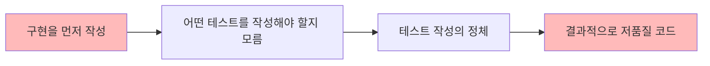
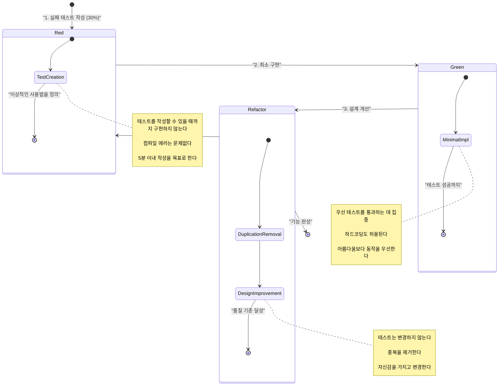
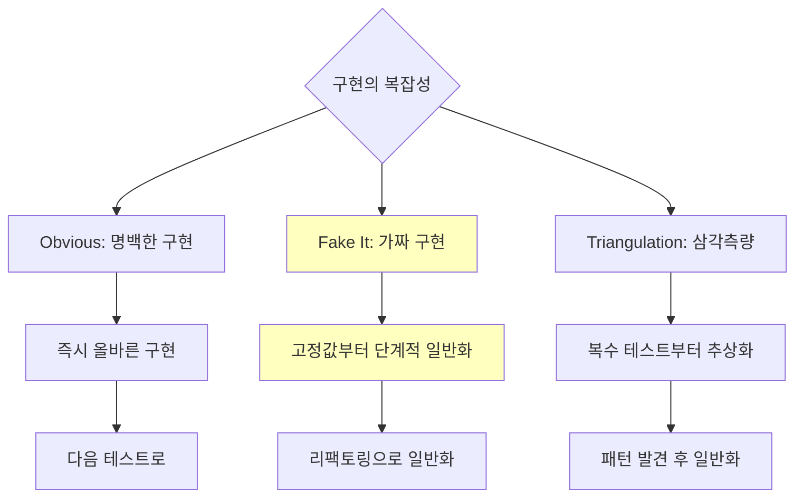
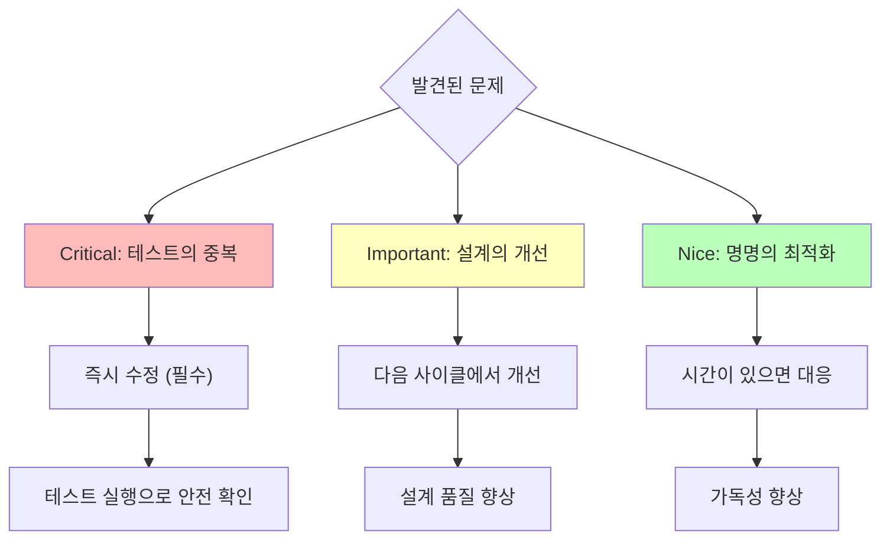
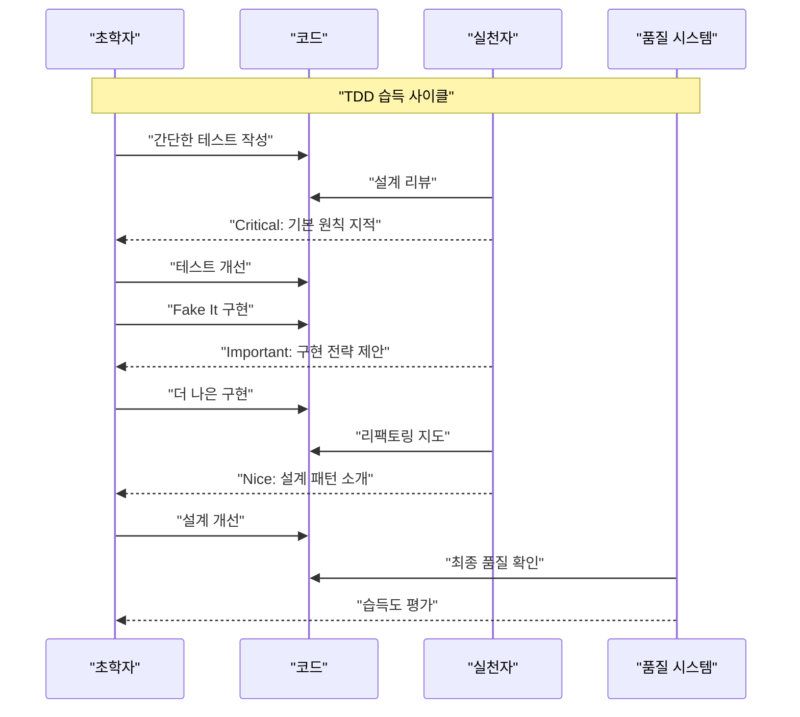
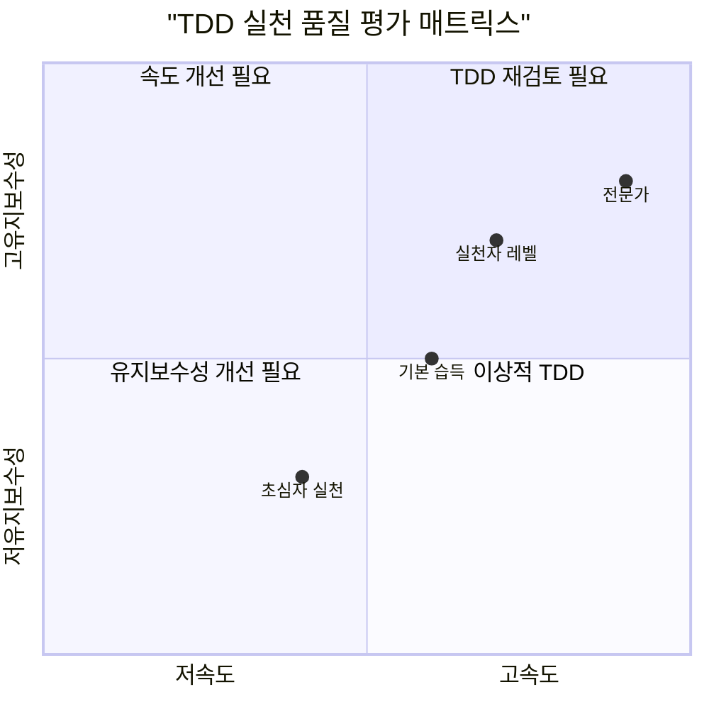
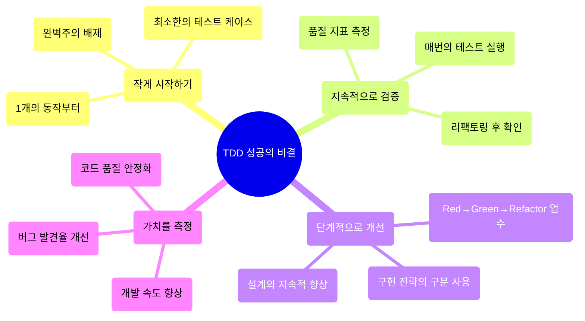

# 테스트 주도 개발(TDD) 실천 가이드

## 본 문서의 목적

**10분으로 TDD의 핵심을 이해하고, 오늘부터 실천할 수 있는** 가이드입니다. 테스트를 먼저 작성함으로써 더 나은 설계와 신뢰성 높은 코드를 효율적으로 개발할 수 있습니다.

## 핵심 원칙: Red-Green-Refactor

**"실패 테스트 작성(Red) → 최소 구현(Green) → 설계 개선(Refactor)"**

### 30% 테스트란?

최소한의 테스트 케이스부터 시작하는 접근법입니다. 완벽을 추구하지 말고, 먼저 동작하는 것을 만드는 것이 중요합니다.

## 초학자를 위한 퀵 스타트 (지금 바로 시도해보세요)

### 첫 번째 TDD 사이클 (10분)

```javascript
// 1. Red: 실패 테스트 작성 (5분)
test('숫자를 2배로 만든다', () => {
  expect(double(5)).toBe(10)
})
// → double 함수가 존재하지 않으므로 실패

// 2. Green: 최소 구현 (3분)
function double(n) {
  return 10 // 하드코딩도 괜찮습니다
}
// → 테스트 성공

// 3. Refactor: 일반화 (2분)
function double(n) {
  return n * 2 // 올바른 구현으로 개선
}
```

## 왜 테스트 주도 개발이 필요한가?

### 문제: 기존의 "구현 우선" 접근법



### 해결책: TDD의 "테스트 우선" 접근법

| TDD 원칙                    | 개발에서의 실천          | 즉각적인 이점     |
| -------------------------- | --------------------- | ------------------ |
| **작은 단계**         | 1개의 동작부터 시작 | 오늘부터 실행 가능   |
| **테스트 주도**             | 실패 테스트를 먼저 정의  | 명확한 성공 기준     |
| **지속적 리팩토링** | 안전한 설계 개선        | 두려움 없이 변경 가능 |

## 1. TDD 개발의 3단계: Red-Green-Refactor

### 기본 사이클의 시각화



### 각 단계의 실천 방법

#### 🔴 Red (실패 테스트): 이상적인 사용법 정의

**실습 예1: 계산기 기능의 30% 테스트**

```typescript
// 30% 테스트: 최소한의 기대값 정의
describe('Calculator', () => {
  it('두 수를 더할 수 있다', () => {
    const calculator = new Calculator()
    const result = calculator.add(2, 3)
    expect(result).toBe(5)
  })
})

// 이 시점에서 Calculator 클래스는 존재하지 않습니다
// 컴파일 에러는 예상대로의 "Red" 상태입니다
```

**실습 예2: 사용자 인증의 30% 테스트**

```typescript
// 30% 테스트: 기본적인 성공 케이스만
describe('UserAuth', () => {
  it('올바른 인증 정보로 로그인 성공', () => {
    const auth = new UserAuth()
    const result = auth.login('user@example.com', 'password123')
    expect(result.success).toBe(true)
  })
})

// 에러 케이스나 검증은 다음 사이클에서 추가
```

**30% 테스트 작성의 판정 기준**

- [ ] 1개의 동작을 명확히 표현할 수 있다
- [ ] 구현이 존재하지 않아도 테스트의 의도를 이해할 수 있다
- [ ] 5분 이내에 기술 가능한 최소한의 기대값

### F.I.R.S.T. 원칙: 좋은 테스트의 기준

- **F**ast: 고속 실행 (0.1초 이내)
- **I**ndependent: 독립성 (다른 테스트에 의존하지 않음)
- **R**epeatable: 재현성 (몇 번이고 같은 결과)
- **S**elf-validating: 자기 검증 (성공/실패가 명확)
- **T**imely: 적시성 (구현 전에 작성)

#### 🟢 Green (최소 구현): 테스트 성공을 위한 최단 경로

**검증 가능한 구현 기준**

```yaml
# 최소 구현 품질의 단위 테스트 (5분으로 실시)
implementation_check:
  functionality:
    - [ ] 테스트가 녹색이다
    - [ ] 컴파일 에러가 해결되었다
    - [ ] 의도한 동작을 실현하고 있다

  simplicity:
    - [ ] 가장 간단한 구현을 선택하고 있다
    - [ ] 불필요한 복잡성을 포함하지 않는다
    - [ ] 필요에 따라 하드코딩을 사용하고 있다

# 성공 예: ✅ 테스트 통과, ✅ 최소 구현, ✅ 신속한 완료
```

**구현 전략의 선택**



#### 🔵 Refactor (설계 개선): 안전한 품질 향상

**개선의 실행 순서**



## 2. 효과적인 TDD 실천 프로세스

### 초학자와 실천자의 역할 분담

| 역할                 | 초학자 접근법       | 실천자 접근법       |
| -------------------- | ------------------------ | ------------------------ |
| **Red단계**      | 간단한 성공 케이스부터 시작 | 엣지 케이스도 포함하여 설계 |
| **Green단계**    | Fake It로 확실한 성공 체험  | 상황에 따라 전략 선택     |
| **Refactor단계** | 명백한 중복만 제거     | 설계 패턴을 적극 활용   |

### 단계별 TDD 습득 프레임워크



### 구조화된 TDD 기준

#### 🔴 고우선도: 테스트 작성 능력 확보

**검증 항목 (400자 이내로 체크)**

| 체크 항목       | 합격 기준            | 실패 시 대응           |
| ------------------ | ------------------- | ---------------------- |
| **테스트의 명확성** | 1개의 동작에 집중 | 테스트를 분할하여 재작성 |
| **구현 독립성**     | 구현 없이 이해 가능  | 테스트 표현을 개선     |
| **실패 확인**       | 예상대로 실패한다  | 구현이 없음을 확인   |

#### 🟡 중우선도: 구현 품질 향상

**개선의 관점**

```yaml
implementation_improvement:
  strategy:
    - [ ] 적절한 구현 전략을 선택하고 있다
    - [ ] 최소한의 변경으로 테스트를 통과하고 있다
    - [ ] 설계의 의도가 명확히 표현되고 있다

  quality:
    - [ ] 코드의 가독성이 높다
    - [ ] 책임이 적절히 분리되어 있다
    - [ ] 향후 확장성을 고려하고 있다
```

#### 🟢 저우선도: 개발 경험의 최적화

**최적화 요소**

| 개선 항목                 | 실시 기준           | 자동화 가능성          |
| ------------------------ | ------------------ | --------------------- |
| **테스트 실행 속도**       | 0.1초 이내/테스트   | ✅ 자동 측정 가능       |
| **명명의 일관성**         | 팀 규약 준수   | ⚠️ 린터로 설정 가능 |
| **리팩토링 빈도** | 3번째 Red 전에 실시 | ⚠️ 인간의 판단이 필요   |

## 3. 지속적 TDD 개선과 메트릭

### TDD 품질의 정량 평가



### TDD 개발 개선의 KPI

| 메트릭               | 측정 방법               | 목표값    | 달성 시 액션       |
| ------------------------ | ---------------------- | --------- | ------------------------ |
| **사이클 속도**         | Red→Green→Refactor 시간 | 10분 이내  | 더 복잡한 기능에 도전 |
| **테스트 품질**           | F.I.R.S.T. 원칙 준수율 | 95% 이상   | 팀 표준으로 전개 |
| **리팩토링 빈도** | Green 후 개선 실시율    | 80% 이상   | 설계 패턴을 학습 |
| **습득 속도**             | 기본 사이클 완료까지   | 1주일 이내 | 실제 프로젝트에 적용 |

## 4. 지금 바로 시작할 수 있는 액션 플랜

### 단계별 실천 스텝

#### 💡 오늘 (30분): TDD 개발을 체험

**초학자용:**

- [ ] 간단한 기능 (덧셈 등)으로 1개의 테스트를 작성한다
- [ ] Red → Green → Refactor를 1회 완료한다
- [ ] 각 단계의 시간을 측정한다 (Red: 5분, Green: 10분, Refactor: 15분)

**실천자용:**

- [ ] 더 복잡한 기능으로 TDD 사이클을 실천한다
- [ ] 복수의 구현 전략 (Fake It, Obvious, Triangulation)을 시도한다
- [ ] 리팩토링에서 설계 패턴을 적용한다

#### 📚 이번 주 (3일): 기본 패턴 습득

**초학자용:**

- [ ] Red-Green-Refactor를 10회 실천한다
- [ ] F.I.R.S.T. 원칙을 따른 테스트를 작성한다
- [ ] 기본적인 구현 전략을 구분하여 사용한다

**실천자용:**

- [ ] 복잡한 비즈니스 로직에 TDD를 적용한다
- [ ] 테스트 더블 (Mock, Stub)을 활용한다
- [ ] CI/CD 파이프라인에 통합한다

#### 🏢 이번 달 (지속적 개선): TDD 문화 확립

**팀 전체:**

- [ ] TDD 실천 기준을 팀에서 통일한다
- [ ] 코드 리뷰에 TDD 관점을 추가한다
- [ ] 정기적인 TDD 몹 프로그래밍을 개최한다

### TDD 성공 패턴의 시각화



## 정리: TDD로 "신뢰할 수 있는 코드" 구축하기

### 핵심 가치의 재확인

1. **두려움 관리**: 테스트 퍼스트로 불안을 구체적인 행동으로 전환
2. **품질 중심**: 지속적인 검증을 통해 신뢰성 확보
3. **검증 가능한 개선**: 객관적 지표를 통해 단계적으로 기술 향상
4. **지속 가능한 개발**: 변화하는 요구사항에 유연하게 대응

### 행동으로의 전환

기존의 "구현 후 테스트"에서 "테스트 작성 후 구현"으로의 전환을 통해 진정으로 신뢰할 수 있는 소프트웨어를 효율적으로 개발할 수 있습니다.

**오늘부터 시작해 보세요. 첫 번째 테스트는 30% 완성도로 충분합니다. 실패로부터 시작하는 것이 TDD의 첫 단계입니다.**

---

## 부록: 실용적 체크리스트와 템플릿

### 30% 테스트 작성 템플릿

```javascript
// [기능명] (30% 테스트)

describe('[클래스명]', () => {
  it('[기대하는 동작]', () => {
    // Given: 전제 조건 (1-2행)
    const target = new [클래스명]();

    // When: 실행 (1행)
    const result = target.[메서드명]([매개변수]);

    // Then: 검증 (1행)
    expect(result).toBe([기대값]);
  });
});

// 구현 전략 선택 지침:
// - 간단: Obvious Implementation
// - 약간 복잡: Fake It → 단계적 일반화
// - 복잡: Triangulation (복수 테스트 케이스)
```

### 언어별 테스트 프레임워크 예

```javascript
// JavaScript/TypeScript: Jest, Mocha, Vitest
// Python: pytest, unittest
// Java: JUnit
// C#: NUnit, xUnit
// Ruby: RSpec
// Go: testing package
```

### TDD 실천 체크리스트 (정량적 평가 기준)

```yaml
tdd_practice_checklist:
  red_phase:
    - [ ] 테스트가 실패하는 것을 확인 (실행 결과 Red)
    - [ ] 1개의 동작에 집중 (단일 책임 원칙)
    - [ ] 구현 없이 의도를 이해할 수 있다 (가독성 8/10점 이상)

  green_phase:
    - [ ] 테스트가 성공하는 것을 확인 (실행 결과 Green)
    - [ ] 최소한의 변경으로 구현되어 있다 (차분 10행 이내)
    - [ ] 구현 전략이 적절히 선택되어 있다 (초심자는 Fake It 권장)

  refactor_phase:
    - [ ] 테스트가 계속 성공한다 (회귀 테스트 클리어)
    - [ ] 코드의 중복이 제거되어 있다 (DRY 원칙 준수)
    - [ ] 설계가 개선되어 있다 (가독성·유지보수성 향상)

# TDD 사이클 시간의 목안
cycle_time_allocation:
  red_phase: 5분 (테스트 작성·실패 확인)
  green_phase: 10분 (최소 구현·성공 확인)
  refactor_phase: 15분 (중복 제거·설계 개선)
  total: 30분 이내 (1사이클 완료)
```