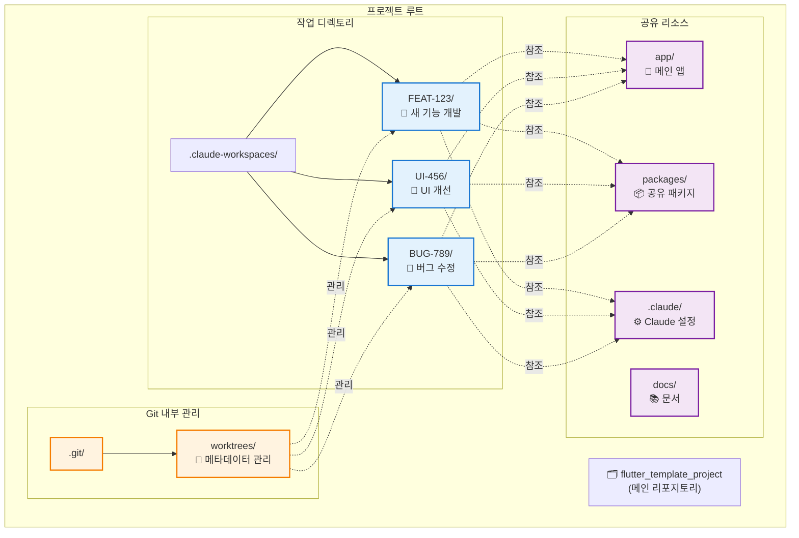
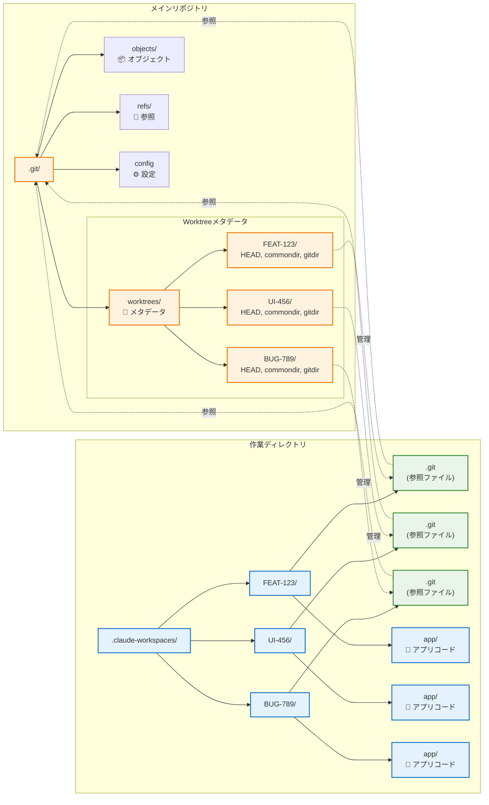
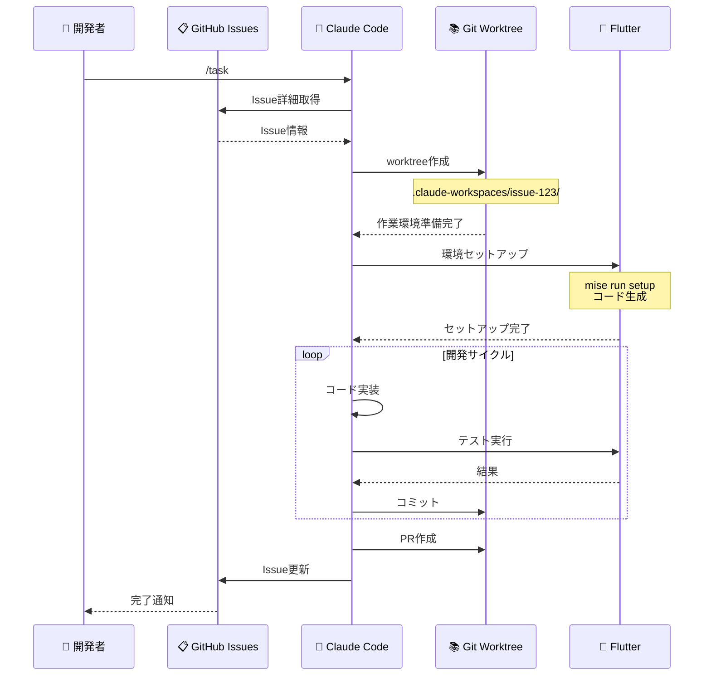
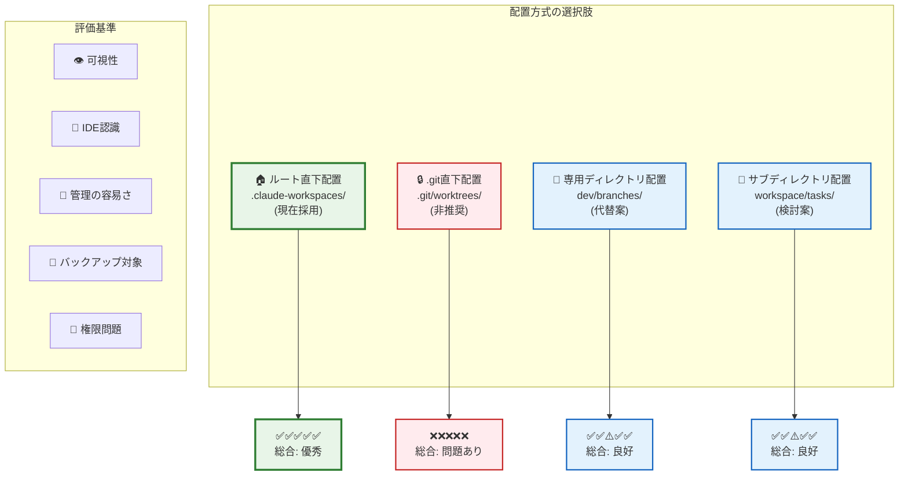
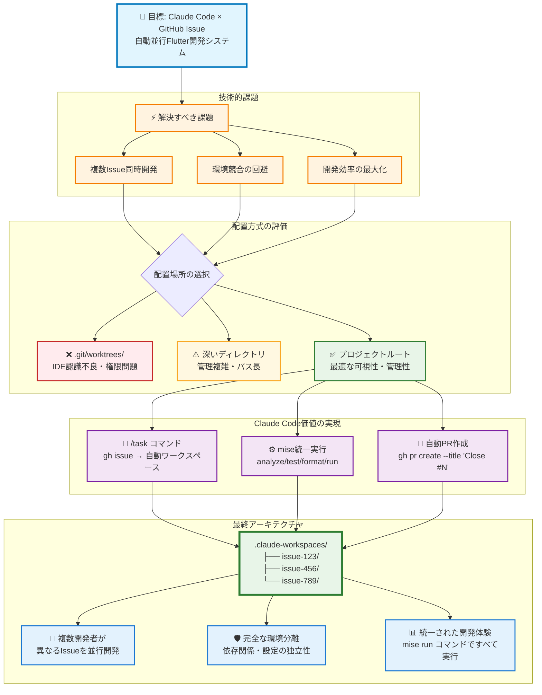

# Claude Code Git Worktree 아키텍처 설계서

## 문서 개요

본 문서에서는 Claude Code와 GitHub Issue를 통합한 Flutter 병렬 개발 시스템에서의 git worktree 아키텍처 설계 사상과 구현 세부사항을 설명합니다.

### 설계 목표

- **병렬 개발 구현**: 복수의 GitHub Issue를 동시 병렬로 안전하게 개발
- **환경 독립성 확보**: 태스크 간 간섭·경합 상태의 완전 배제
- **개발 효율성 최대화**: 통일된 툴체인을 통한 개발 경험 향상
- **유지보수성 확보**: 명확한 디렉토리 구조를 통한 관리 비용 절감

### 아키텍처 방침

`.claude-workspaces` 디렉토리를 프로젝트 루트에 배치함으로써 Git 내부 구조와의 분리, IDE 인식 최적화, 관리 스크립트의 간소화를 구현합니다. 각 GitHub Issue는 독립된 워크스페이스를 가지며, mise를 통한 통일된 태스크 실행 환경에서 동작합니다.

## 목차

1. [현재의 배치 방침](#현재의-배치-방침)
2. [.git 디렉토리 직하 배치가 문제가 되는 이유](#git-디렉토리-직하-배치가-문제가-되는-이유)
3. [루트 디렉토리 배치의 장점](#루트-디렉토리-배치의-장점)
4. [기술적 고려사항](#기술적-고려사항)
5. [대안과의 비교](#대안과의-비교)
6. [정리](#정리)

## 현재의 배치 방침

### 디렉토리 구조

```bash
flutter_template_project/
├── .claude-workspaces/          # ✅ 루트 직하에 배치 (권장)
│   ├── FEAT-123/                # 태스크1의 독립 작업 디렉토리
│   ├── UI-456/                  # 태스크2의 독립 작업 디렉토리
│   └── BUG-789/                 # 태스크3의 독립 작업 디렉토리
├── .git/                        # Git 내부 관리용
│   ├── worktrees/              # ⚠️ Git의 내부 관리용 (기존)
│   ├── refs/
│   ├── objects/
│   └── config
├── .vscode/                     # VS Code 설정
│   └── settings.json
├── app/                         # 메인 Flutter 애플리케이션
│   ├── lib/                     # Dart 소스코드
│   │   ├── pages/              # UI 페이지
│   │   ├── router/             # go_router 설정
│   │   └── i18n/               # slang 생성 다국어 파일
│   ├── assets/i18n/            # JSON 번역 파일
│   ├── test/                   # 위젯 테스트
│   └── [platform]/             # 플랫폼 고유 파일
├── packages/                    # 공유 패키지 (현재 공백)
├── docs/                        # 프로젝트 문서
│   ├── CLAUDE_4_BEST_PRACTICES.md
│   ├── COMMITLINT_RULES.md
│   └── WORKTREE_ARCHITECTURE.md
├── scripts/                     # 빌드·유틸리티 스크립트
├── pubspec.yaml                 # 워크스페이스 설정
├── package.json                 # Node.js 의존성
└── LICENSE                      # MIT 라이센스
```

### Git Worktree 아키텍처 개요



## .git 디렉토리 직하 배치가 문제가 되는 이유

### 1. 숨김 디렉토리로 인한 접근성 문제

#### 문제가 있는 배치 예시

```bash
flutter_template_project/
├── .git/
│   ├── worktrees/              # ❌ 숨김 디렉토리 내부로 보기 어려움
│   │   ├── feature-FEAT-123/
│   │   └── feature-UI-456/
```

#### 구체적인 문제

- **파일 매니저**: 대부분의 도구에서 숨김 디렉토리가 표시되지 않음
- **개발자 경험**: 작업 장소 파악이 어려움
- **신규 참여자**: 프로젝트 구조의 이해가 곤란

### 2. IDE·에디터의 인식 문제

#### VS Code에서의 문제 예시

```json
// .vscode/settings.json이 올바르게 인식되지 않음
{
  "dart.flutterSdkPath": "/path/to/flutter",
  "dart.analysisServerFolder": ".dart_tool"
}
```

#### IntelliJ IDEA에서의 문제 예시

```bash
.git/worktrees/feature-FEAT-123/app/
# ↑ IDE가 프로젝트 루트로 인식하기 어려움
# ↑ Flutter SDK 검출에 실패할 가능성
# ↑ 설정 파일(.idea/)이 올바르게 동작하지 않음
```

#### 영향 범위

- Flutter SDK의 자동 검출 실패
- 디버거나 핫 리로드의 문제
- 플러그인이나 확장 기능의 오동작
- 코드 완성·분석 기능의 저하

### 3. Git 내부 구조와의 경합

#### Git의 기존 구조

```bash
.git/
├── worktrees/                  # ⚠️ Git이 이미 사용 중
│   ├── feature-FEAT-123/       # worktree의 메타데이터
│   │   ├── HEAD               # 브랜치 참조
│   │   ├── commondir          # 공통 디렉토리 참조
│   │   ├── gitdir             # .git 디렉토리 참조
│   │   └── locked             # 잠금 상태
```

#### 경합으로 인한 문제

- **네임스페이스의 충돌**: 동명 디렉토리로 인한 혼란
- **내부 명령의 오동작**: `git worktree prune` 등에서 예기치 않은 동작
- **메타데이터의 파손 위험**: Git 업데이트 시의 호환성 문제
- **디버깅의 어려움**: 내부 파일과 작업 파일의 구별이 곤란

### 4. 백업·동기 도구에서의 제외

#### 일반적인 백업 설정

```bash
# rsync에서의 제외 설정
rsync --exclude='.git' source/ dest/
# ↑ .git 하위의 worktrees도 제외되어 버림

# .gitignore_global
.git/
# ↑ 많은 동기 도구에서 제외 대상
```

#### 영향받는 도구

- **클라우드 동기**: Google Drive, Dropbox, OneDrive
- **백업 소프트**: Time Machine, Carbon Copy Cloner
- **CI/CD 시스템**: GitHub Actions, GitLab CI

### 5. 권한·보안 문제

#### 권한 설정의 제약

```bash
# .git 디렉토리의 일반적인 권한
drwxr-xr-x  .git/                # 읽기 제한

# 작업 디렉토리에 필요한 권한
drwxrwxrwx  worktrees/feature-FEAT-123/  # 읽기쓰기실행 권한
```

#### 보안 정책에서의 제약

- 기업 환경에서의 `.git` 액세스 제한
- 보안 소프트에 의한 숨김 디렉토리 감시
- CI/CD에서의 권한 오류

### 6. 관리 스크립트의 복잡화

#### 현재의 스크립트(간단함)

```bash
# scripts/manage-flutter-tasks.sh
for workspace in .claude-workspaces/*/; do
    if [ -d "$worktree" ]; then
        cd "$worktree"
        flutter analyze
        cd - > /dev/null
    fi
done
```

#### .git 하위의 경우(복잡함)

```bash
# 복잡한 처리가 필요
for worktree in .git/worktrees/*/; do
    # 숨김 디렉토리 체크
    if [[ "$(basename "$worktree")" != "."* ]]; then
        # 권한 체크
        if [ -r "$worktree" ] && [ -w "$worktree" ]; then
            # Git 내부 파일과의 구별
            if [ -f "$worktree/app/pubspec.yaml" ]; then
                cd "$worktree"
                flutter analyze
                cd - > /dev/null
            fi
        fi
    fi
done
```

## 루트 디렉토리 배치의 장점

### 1. 명확한 가시성

```bash
flutter_template_project/
├── .claude-workspaces/          # ✅ 一目で作業ディレクトリと分かる
│   ├── issue-123/               # ✅ 各GitHub Issueが明確
│   └── issue-456/               # ✅ 進行中のタスクが把握しやすい
```

### 2. IDE・エディタでの適切な認識

```bash
# VS Codeでの認識例
.claude-workspaces/issue-123/
├── .vscode/                     # ✅ 設定ファイルが正しく動作
├── app/lib/                     # ✅ Dartコード解析が正常
├── pubspec.yaml                 # ✅ Flutter SDKが正しく検出
└── analysis_options.yaml       # ✅ Lintルールが適用
```

### 3. 並行開発での独立性

```bash
# 各GitHub Issueが完全に独立
cd .claude-workspaces/issue-123  # GitHub Issue #123: 新機能開発
mise run test                     # テスト実行

cd ../issue-789                  # GitHub Issue #789: バグ修正
mise run test                    # テスト実行
```

### 4. 管理スクリプトでの効率的な処理

```bash
# シンプルで効率的な処理
./scripts/manage-flutter-tasks.sh list
# ↓
📋 Active Flutter Tasks:
   - FEAT-123: ✅ Running (Android)
   - UI-456:   ✅ Running (iOS)
   - BUG-789:  🧪 Testing
```

### 5. 共通リソースへの適切なアクセス

```bash
.claude-workspaces/issue-123/
├── app/                         # このGitHub Issue専用のFlutterアプリ
├── packages/                    # 共有パッケージ
├── ../../.vscode/               # ✅ 共通のVS Code設定
├── ../../scripts/               # ✅ 共通の管理スクリプト
├── ../../docs/                  # ✅ 共通ドキュメント
└── ../../CLAUDE.md              # ✅ Claude Code設定
```

## 技術的考慮事項

### 1. Git Worktreeの仕組み

#### Git Worktree内部構造図



#### 内部動作

```bash
# worktree作成時の内部処理
git worktree add .claude-workspaces/FEAT-123 feature/FEAT-123

# 内部で作成されるファイル
.git/worktrees/FEAT-123/
├── HEAD                        # ブランチ参照
├── commondir                   # ../../
├── gitdir                      # .claude-workspaces/FEAT-123/.git
└── locked                      # 使用中フラグ
```

#### worktreeディレクトリの構造

```bash
.claude-workspaces/FEAT-123/
├── .git                        # → .git/worktrees/FEAT-123/への参照
├── app/                        # Flutterアプリケーション
├── packages/                   # 共有パッケージ
└── docs/                       # ドキュメント
```

### 2. Claude Codeとの連携

#### 並行開発フロー図



#### プロセス管理での利点

```bash
# PIDファイルでの管理
pids/
├── claude-flutter-issue-123.pid  # ✅ GitHub Issue IDが明確
├── claude-flutter-issue-456.pid  # ✅ プロセス特定が容易
└── claude-flutter-issue-789.pid  # ✅ 管理スクリプトで一元処理
```

#### ログ管理での利点

```bash
# ログファイルでの追跡
logs/
├── claude-flutter-issue-123.log  # ✅ GitHub Issue別ログが明確
├── claude-flutter-issue-456.log  # ✅ デバッグが容易
└── claude-flutter-issue-789.log  # ✅ 進捗監視が効率的
```

### 3. リソース管理

#### メモリ・CPU使用量

```bash
# 各GitHub Issue対応ワークスペースでの独立実行
.claude-workspaces/issue-123/: CPU 15.2%, MEM 8.1%
.claude-workspaces/issue-456/: CPU 8.7%, MEM 5.3%
.claude-workspaces/issue-789/: CPU 12.1%, MEM 6.8%
```

#### ディスク使用量

```bash
# 効率的な容量管理
du -sh .claude-workspaces/*/
480M    .claude-workspaces/issue-123/
320M    .claude-workspaces/issue-456/
180M    .claude-workspaces/issue-789/
```

## 配置方式の比較分析

### 配置方式比較表



## 代替案との比較

### 1. 現在の方式（推奨）

```bash
flutter_template_project/
├── .claude-workspaces/          # ✅ ルート直下
```

**利点:**

- ✅ 明確な可視性
- ✅ IDE・エディタでの適切な認識
- ✅ 管理スクリプトのシンプル性
- ✅ バックアップ・同期の容易性

### 2. .git直下配置（非推奨）

```bash
flutter_template_project/
├── .git/
│   ├── worktrees/              # ❌ 隠しディレクトリ
```

**問題点:**

- ❌ 隠しディレクトリで見えにくい
- ❌ IDE・エディタでの認識問題
- ❌ Git内部構造との競合
- ❌ バックアップから除外される

### 3. 専用ディレクトリ配置（代替案）

```bash
flutter_template_project/
├── dev/
│   ├── branches/               # 🔄 代替可能
```

**評価:**

- 🔄 可視性は良好
- 🔄 管理の複雑化
- 🔄 既存スクリプトの変更が必要

### 4. サブディレクトリ配置（検討案）

```bash
flutter_template_project/
├── workspace/
│   ├── tasks/                  # 🔄 階層が深い
```

**評価:**

- 🔄 構造は整理される
- 🔄 パスが長くなる
- 🔄 Claude Codeスクリプトの修正が必要

## まとめ

### ルートディレクトリ配置を選択する理由

1. **開発者体験の向上**
   - 明確な可視性による作業効率の向上
   - IDE・エディタでの適切な機能利用

2. **技術的な安定性**
   - Git内部構造との競合回避
   - 権限・セキュリティ問題の回避

3. **運用の効率性**
   - 管理スクリプトのシンプル性
   - バックアップ・同期の確実性

4. **Claude Codeとの最適な連携**
   - 並行開発での独立性確保
   - プロセス・ログ管理の効率化

### 推奨事項

✅ **DO（推奨）:**

- `.claude-workspaces/` をプロジェクトルートに配置
- 各タスクを独立したディレクトリで管理
- 共通リソースへの相対パス参照を使用
- mise コマンドによる統一されたタスク実行
- Claude Code との最適な連携

❌ **DON'T（非推奨）:**

- `.git/worktrees/` 内での作業ディレクトリ配置
- 隠しディレクトリでの開発作業
- Git内部構造との名前空間競合
- 直接的なflutter/melos コマンド実行（mise経由を推奨）

### 結論

プロジェクトルートへの`.claude-workspaces`配置は、Claude Codeによる並行Flutter開発において、**技術的安定性**、**開発者体験**、**運用効率性**のバランスを最適化する最良の選択です。

#### アーキテクチャ決定図



この設計により、Claude Codeによる並行Flutter開発において、**技術的安定性**、**開発者体験**、**運用効率性**のバランスを最適化した環境が実現されています。

## 現在のプロジェクト状況

**実装済み要素:**

- ✅ `.claude-workspaces` ディレクトリ構成
- ✅ mise による統一されたタスク管理システム
- ✅ Riverpod + go_router + slang アーキテクチャ
- ✅ VS Code 統合設定（.vscode/settings.json）
- ✅ Claude 4 Best Practices 準拠のドキュメント構造
- ✅ GitHub Issue 連携ワークフロー

**技術スタック:**

- **Flutter SDK**: mise による統一バージョン管理
- **Melos**: monorepo パッケージ管理とワークスペース設定
- **Riverpod**: type-safe な状態管理（@riverpod annotation）
- **go_router**: 宣言的ルーティング（type-safe navigation）
- **slang**: 国際化・多言語対応（ja/en サポート）
- **build_runner**: コード生成（freezed, json_annotation）
- **GitHub CLI**: Issue管理とPR作成の自動化

**開発コマンド例:**

```bash
# GitHub Issue ワークスペース内での開発
cd .claude-workspaces/issue-[NUMBER]/
mise run dev        # 開発環境起動
mise run test       # テスト実行
mise run analyze    # 静的解析
mise run format # コード整形

# GitHub Issue 連携
gh issue view [NUMBER]              # Issue詳細表示
gh pr create --title "Close #[NUMBER]"  # Issueクローズを含むPR作成
gh issue comment [NUMBER] --body "実装完了"  # Issue進捗更新
```

---

**関連ドキュメント:**

- [Claude 4 ベストプラクティス](CLAUDE_4_BEST_PRACTICES.md)
- [コミットルール](COMMITLINT_RULES.md)
- [プロジェクト設定](../CLAUDE.md)
- [README(한국어)](../README.md)
